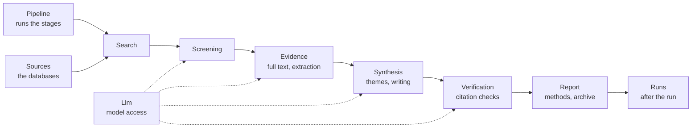

# Architecture

TraceableAI turns a research question into a PRISMA 2020 systematic review in which every cited statement can be traced to a passage in the paper it cites. This page is the map of the code. It explains how the folders are laid out and why, so you can find the right file without reading everything. The [developer wiki](docs/wiki/README.md) goes deeper into each part.

## One idea shapes the layout

The code is grouped by the stage of the review it belongs to, and the stages run in the same order as the folders below. A review is one long pipeline: the question becomes search strings, the search becomes records, screening turns records into included studies, the studies become evidence, the evidence becomes text, and the text is checked before it is reported. If you know which step of a review you want to change, you know which folder to open.

| Folder | What it does | Start reading at |
|---|---|---|
| `Pipeline/` | Runs one review from start to finish; the ledger, the request and the shared helpers | `PrismaReviewEngine.cs` → `RunReviewAsync` |
| `Sources/` | One class per bibliographic database, behind `IAcademicSource` | `IAcademicSource.cs` |
| `Search/` | Search strings, querying, de-duplication, citation chaining, saturation | `PrismaReviewEngine.Search.cs` |
| `Screening/` | Two independent screenings, the peer-review filter, exclusion reasons, the human review | `PrismaReviewEngine.Screening.cs` |
| `Evidence/` | Open-access full texts, data extraction and quality appraisal, each value with a verified quote | `StudyExtractor.cs` |
| `Synthesis/` | Coding findings into themes and writing one cited section per theme; the artifact | `PrismaReviewEngine.Thematic.cs` |
| `Verification/` | Citation range check, citation support check against the paper, re-checks | `CitationSupportChecker.cs` |
| `Report/` | The report, the methods text and flow diagram written in code, references, archive and manifest | `PrismaReviewEngine.Report.cs` |
| `Runs/` | After a run has started: edit keys, reviewer notes, metrics, clean-up | `PrismaReviewEngine.Ownership.cs` |
| `Llm/` | Talking to the model, reading JSON answers, recording every call, prompt safety | `LlmJson.cs` |
| `Web/` | The website around the review: SEO, `/health`, security headers, quota, glossary | `SiteSeo.cs` |
| `Components/` | The Blazor UI: `Pages/` (routable pages), `Dashboard/` (parts of the run view), `Layout/` (shared) | `Pages/Home.razor` |

Every folder has a short `README.md` that says what lives there. The tests in `AuBtechReviewAgent.Tests/` use the same folders, so the tests for screening are in `AuBtechReviewAgent.Tests/Screening/`. Test helpers (the fake model, temporary folders) are in `Support/`.

## One class, split by stage

Almost all of the logic is in one class, `PrismaReviewEngine`, because a review is one sequence of steps that share a lot of state (the run's ledger, the papers, the chat with the model). The class is declared `partial` and split into files named `PrismaReviewEngine.<Stage>.cs`, and each file lives in the folder of its stage. The class is one unit for the compiler and many small files for a reader.

All code uses the single namespace `AuBtechReviewAgent`. The folders organise the files; they are not namespaces, so moving a file never changes how it is referenced. `.editorconfig` switches off the analyzer rule that would ask for one namespace per folder.

## The rules the design protects

These rules are why the code looks the way it does. A change that breaks one of them breaks what TraceableAI is for.

**The model's text is never trusted on its own.** Every answer from the model is a JSON object that is validated in code before it is used, and every value that claims to come from a paper must carry a quote that is found in the paper's text. A citation verdict counts only when its quote is found word for word.

**What can be counted is written by code, not by the model.** The methods section, the PRISMA flow diagram, the counts, the reference list and the statement on AI use are generated from what the run actually did. The model never describes a step, so it cannot describe one that did not happen.

**Everything is on file.** Each run writes its protocol before searching, its raw database answers, every decision with its reasoning, every model call and the citation audit to its folder. The archive fingerprints every file with SHA-256 in `manifest.json`.

**Results are reproducible where they can be.** Decisions run at temperature 0, and every prompt that makes decisions has a version that is part of the cache key. When you change a screening prompt, raise `ScreeningPromptVersion`.

## Where state lives

A run lives in its own folder under `WorkspaceStore/{runId}/`. The ledger is `transparent-process.json` (the `ReviewState` type in `Pipeline/ReviewModels.cs`), and the other files are described on [page 5 of the wiki](docs/wiki/05-ledger-and-archive.md). There is no database: the dashboard reads the ledger, the cache keeps answers under `App_Data/cache/`, and finished runs leave one line in the metrics store under `App_Data/metrics/`. Runs are deleted after `Runs:RetentionDays`.

## What is around the app

| Path | What it is |
|---|---|
| `AuBtechReviewAgent.Tests/` | xUnit tests, all offline, with a scripted fake model |
| `tools/ScreeningEval/` | Command-line tool that measures screening accuracy against human decisions |
| `tools/a11y/` | The accessibility check that runs in CI |
| `docs/wiki/` | The developer wiki, copied to the Wiki tab on every merge |
| `deploy/` | The page shown while a new version is uploaded |
| `.github/workflows/` | CI, CodeQL, release and wiki sync |
| `AGENTS.md` | Instructions for AI coding assistants working in this repository |
