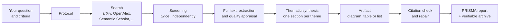

# TraceableAI

**Literature reviews written by AI, where every citation can be checked.**

Ask a language model to review the literature and you get fluent text with citations that are often wrong, mismatched or invented. TraceableAI runs a full PRISMA 2020 systematic review instead, and for every cited sentence it shows you the passage in the paper that supports it, or tells you plainly that it could not find one.

Built at the Department of Business Development and Technology (BTECH), Aarhus University, and presented at OSSYM 2026, the 8th International Open Search Symposium.

[](https://github.com/lauPhilip/au-btech-literature-review-agent/actions/workflows/ci.yml)
[](https://dotnet.microsoft.com/en-us/download/dotnet/10.0)
[](https://prisma-statement.org/)
[](LICENSE)
[](https://opensearchfoundation.org/)

## What it does

You type a research question and your inclusion and exclusion criteria. TraceableAI writes the review protocol before it searches anything, searches open scholarly databases, screens every record twice, reads the open-access full texts, extracts and appraises each study, groups the findings into themes, and writes a PRISMA 2020 report. Then it checks its own citations.


```mermaid
flowchart LR
    Q[Your question<br/>and criteria] --> P[Protocol]
    P --> S[Search<br/>arXiv, OpenAlex,<br/>Semantic Scholar, ...]
    S --> SC[Screening<br/>twice, independently]
    SC --> E[Full text, extraction<br/>and quality appraisal]
    E --> T[Thematic synthesis<br/>one section per theme]
    T --> A[Artifact<br/>diagram, table or list]
    A --> C[Citation check<br/>and repair]
    C --> R[PRISMA report<br/>+ verifiable archive]
```

You can also ask for an artifact built from the findings: a concept map, a flowchart, a comparison table or a list of recommendations. It is drawn from what the review found, and what it cites is checked like the text.

In the finished report, every citation number is clickable. Click it and you see what the check found: supported, partly supported or not supported, the quote from the paper, and where in the paper it is. Green means the paper says it; orange and red stay in the report on purpose, so you know exactly where to look.

## Why you can trust it more than a chatbot

| | |
|---|---|
| **Citations are checked, not trusted** | Each claim is compared with the cited paper, and a verdict only counts when its supporting quote is found word for word in the paper. Weak citations get a second check and are rewritten from the evidence. |
| **Nothing is written from thin air** | The synthesis is built from findings whose quotes were verified in the papers, and every included study has a place in the evidence map. |
| **Two of everything** | Every record is screened by two independent prompts, and themes are assigned twice; the agreement is reported as Cohen's kappa, like with human reviewers. |
| **The methods are facts, not prose** | The methods section is generated from what the run actually did, so it never describes a database that was not searched or a step that did not happen. |
| **Everything is on file** | The protocol, the raw database responses, every screening decision with its reasoning, every model call and the citation audit are saved, fingerprinted with SHA-256, and downloadable as one archive with a ready-to-compile LaTeX manuscript and BibTeX/RIS files. |
| **Quality you can measure** | A metrics page tracks citation quality, coverage and cost across runs, so you can see whether a change actually helped. |

TraceableAI is a co-pilot for a human reviewer, not a replacement. Its checks make errors findable; they do not make them impossible. The [developer wiki](docs/wiki/08-setup-and-configuration.md#what-the-checks-do-and-do-not-catch) is precise about what the checks catch and what they miss.

## Try it

You need the [.NET 10 SDK](https://dotnet.microsoft.com/en-us/download/dotnet/10.0) and a [Mistral](https://mistral.ai/) API key, or a local model through Ollama.

```
git clone https://github.com/lauPhilip/au-btech-literature-review-agent.git
cd au-btech-literature-review-agent/AuBtechReviewAgent
dotnet user-secrets set "MISTRAL_API_KEY" "your-key-here"
dotnet user-secrets set "OpenSources:ContactEmail" "you@example.org"
dotnet watch
```

Open the address shown in the terminal, go to the dashboard, fill in your question and criteria, and press **Execute search**. A progress bar shows each step; a review of a few dozen papers takes a few minutes. Running with a local model, Docker and every setting are described in [Setup and configuration](docs/wiki/08-setup-and-configuration.md).

## Learn more

The [developer wiki](docs/wiki/README.md) explains how everything works, with diagrams: the [review pipeline](docs/wiki/02-review-pipeline.md), [search and screening](docs/wiki/03-search-and-screening.md), [thematic synthesis and the citation checks](docs/wiki/04-evidence-and-report.md), the [ledger and the archive](docs/wiki/05-ledger-and-archive.md), [the web app and deployment](docs/wiki/06-web-app-and-operations.md), and [how to extend and test it](docs/wiki/07-extending-and-testing.md).

## Citing TraceableAI

If you use TraceableAI in your research, please cite the OSSYM 2026 paper and the software version you used. GitHub's "Cite this repository" button gives both (from `CITATION.cff`).

```bibtex
@inproceedings{lau2026traceableai,
  author    = {Lau, Philip S. P. {\O}. O. and Nidhi},
  title     = {{TraceableAI}: An Open-Source Agentic Framework for {PRISMA}-Compliant Literature Synthesis},
  booktitle = {Proceedings of the 8th International Open Search Symposium (OSSYM 2026)},
  year      = {2026}
}
```

## Contributing

Contributions are welcome: bug reports, ideas, documentation or code. See [CONTRIBUTING.md](CONTRIBUTING.md) and the [Code of Conduct](CODE_OF_CONDUCT.md). If you are not sure where to start, open an issue and ask.

## License

Apache License 2.0; see [LICENSE](LICENSE) and [NOTICE](NOTICE). The SCImago journal ranking data in `AuBtechReviewAgent/ScimagoData` is not covered by it: SCImago allows non-commercial use when the source is cited.
