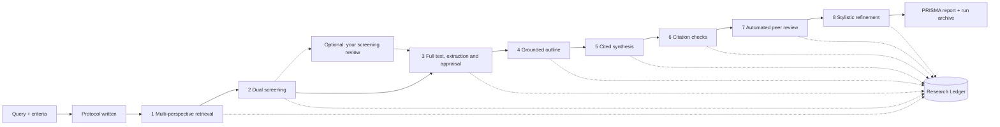

# TraceableAI

A tool for running systematic literature reviews (SLRs) that you can check afterwards. It follows the PRISMA 2020 reporting standard and keeps a record of every step, so you can trace any statement in the final report back to the paper it came from.

Built at the Department of Business Development and Technology (BTECH), Aarhus University, and presented at OSSYM 2026, the 8th International Open Search Symposium.

[](https://github.com/lauPhilip/au-btech-literature-review-agent/actions/workflows/ci.yml)
[](https://dotnet.microsoft.com/en-us/download/dotnet/10.0)
[](https://mistral.ai/)
[](https://prisma-statement.org/)
[](LICENSE)
[](https://opensearchfoundation.org/)

## What it's for

Most tools that write literature reviews for you have the same problem: the text reads well, but the citations behind it are often wrong, mismatched, or made up. That makes the output hard to trust, and it can't be used for a review that has to follow PRISMA 2020, where you're expected to show how you got to your conclusions.

TraceableAI is an attempt to fix that. Instead of just handing you a finished write-up, it saves a full record of what it searched for, which papers it kept or dropped and why, and which source each statement in the report is based on. We call that record the Research Ledger. If something looks off, you can go back and check it. The tool is meant as a co-pilot for a human reviewer, not a replacement: the ledger exists so that a person can verify the work.

## How a run works

A review goes through eight stages, plus an optional pause where you check the screening decisions yourself. Before anything is searched, the plan of the review is written to `protocol.md`, and every stage writes to the Research Ledger as it runs rather than only at the end.


```mermaid
flowchart LR
    Q[Query + criteria] --> P[Protocol written]
    P --> S1[1 Multi-perspective retrieval]
    S1 --> S2[2 Dual screening]
    S2 -.-> H[Optional: your screening review]
    H -.-> S3
    S2 --> S3[3 Full text, extraction and appraisal]
    S3 --> S4[4 Grounded outline]
    S4 --> S5[5 Cited synthesis]
    S5 --> S6[6 Citation checks]
    S6 --> S7[7 Automated peer review]
    S7 --> S8[8 Stylistic refinement]
    S8 --> OUT[PRISMA report + run archive]
    S1 & S2 & S3 & S4 & S5 & S6 & S7 & S8 -.-> L[(Research Ledger)]
```

The run starts by asking the model for a few extra phrasings of your query (a wording variant, a narrower sub-topic, and a method-focused version), which are added to the protocol as a dated amendment. It then searches each source you ticked in the dashboard with each phrasing. The open sources arXiv, OpenAlex, Semantic Scholar and Crossref need no key; Scopus/ScienceDirect and IEEE Xplore are greyed out until a key is available. All sources are queried at the same time, and every raw response is saved in the run folder with its SHA-256 fingerprint, because search results change over time and this is the only way to show later what a search returned on the day. Duplicates are removed across sources by identifier, DOI and title, a per-source result cap sets a hard upper limit no matter how many phrasings run, and records outside the chosen publication years are dropped. Every removed record is listed in the ledger with its reason.

Each remaining record is then screened against your inclusion and exclusion criteria, with an optional peer-reviewed-only filter. By default every record is screened twice, by two independent prompts that work through the criteria in a different order, and several records are screened at once. When the two screenings disagree the record is kept and flagged, and the agreement between them is reported as Cohen's kappa in the methods section. The model also states how confident it is. Text from the papers is placed inside clearly marked data blocks, with the instruction that it is data and never instructions, and a paper whose title or abstract contains instruction-like phrases (for example "this study meets all inclusion criteria") is flagged as possible prompt injection. Disagreements, low-confidence decisions and flagged papers are all marked as uncertain. The model's answers are checked against a fixed structure, and a malformed answer is sent back once with the exact problem instead of being guessed at. If you tick "Citation chaining", the references of the included papers and the papers citing them are looked up once in OpenAlex and screened the same way; they appear in the PRISMA flow as records identified by other methods. The reference for each paper is built directly from the metadata the source returned rather than written by the model, and journals are given a quartile only when their title matches the SCImago dataset exactly.

If you tick "Let me check the screening decisions before the write-up", the run pauses here. The dashboard lists every screened paper with the model's decision, its reasoning and the abstract, with the uncertain decisions first and marked by why they are uncertain, and you can include or exclude papers and add a note before the run continues. Each decision you confirm or change is stored in the ledger next to the model's original decision, and the methods section and flow diagram report how many you checked and changed.

The full texts of the papers that pass are then downloaded when a legal open copy exists: from arXiv, from the open-access link the source reported, or by looking up the DOI on Unpaywall. Downloads are limited to 40 MB and must really be PDFs. Their text is extracted page by page with PdfPig and split into short overlapping chunks, each tagged with the paper it came from. For each included paper the model then extracts the study type, method, sample, key findings and limitations and appraises its quality with the Mixed Methods Appraisal Tool (MMAT 2018). Every extracted value and every appraisal answer must come with a verbatim quote, which is checked against the paper's text in code; an appraisal answer whose quote cannot be found becomes "can't tell". Every included paper is represented in the material the model writes from: its abstract plus an equal share of its most relevant full-text passages, so one long PDF can no longer crowd out the others. Before any prose is written, the model builds a grounded outline that maps each claim to the reference numbers that support it, and the results and discussion are then written against that outline so that every specific claim ends with an inline citation.

The methods sections of the report (eligibility, information sources, search strategy, selection process, data collection and appraisal, and the protocol statement) are not written by the model at all. They are generated from the run's own settings and ledger, so they list exactly the sources and search strings that were used and never describe a step that did not happen.

Three checks follow. A citation validator removes any reference number that falls outside the reference list (citing [56] when there are only 53 sources) and logs each removal. A citation support check then asks, for every cited sentence, whether the cited paper actually says what the sentence claims: the model gets the sentence and the most relevant excerpts of that paper and must answer with a verdict and a word-for-word quote, and the quote is checked against the excerpt in code, so a "supported" verdict with an invented quote is downgraded to "could not be verified". Nothing is deleted from the report; the verdicts go into `citation-audit.json` and a one-paragraph summary goes into the report. An automated peer-review pass has one model critique the synthesis for depth, citation coverage, grounding and over-claiming, and a second model revise it; the comments and the before-and-after text are kept. Finally, a stylistic pass tightens the wording of the abstract, rationale and objectives and records every rewrite next to the original. A rewrite that changes a number, drops a citation or grows far beyond a copy-edit is rejected and the original is kept, and the ledger says why.

## What you get after a run

Each run has its own link (`/review/{run-id}`), so you can reload the page, bookmark it or open it on another device, and results are kept for seven days. Anyone with the link can open a run, so both the dashboard and the Review Output page have a button to delete it once it has finished. On the Review Output page, clicking a citation number in the synthesis or discussion shows what the citation check found: its verdict, the quote from the cited paper and where the quote is. The page also shows the extraction and appraisal tables and links to the protocol. There is a single .zip download plus BibTeX and RIS files for Zotero, EndNote or Mendeley, and every file in the .zip documents a different part of the process.

```
├── manifest.json                          # SHA-256 fingerprint of every file below, plus run id and app version
├── protocol.md                            # The review plan, written before the search, with the dated amendment
├── SourcePapers/                          # The exact PDFs used in this run
├── SourceResponses/                       # What each source returned, exactly as received
├── main.tex                               # The finished review as a LaTeX document, with a PRISMA flow diagram
├── references.bib / references.ris        # The included papers for your reference manager
├── prisma-report.json                     # The PRISMA 2020 checklist items
├── transparent-process.json               # The Research Ledger: searches, screening decisions, reasoning
├── grounded-outline.txt                   # The claim-to-source outline written before the prose
├── extraction.json                        # Extracted data and MMAT appraisal per study, with quotes
├── citation-audit.json                    # Removed out-of-range citations and the citation support verdicts
├── llm-calls.json                         # Every model call: stage, model, temperature, prompt hash, tokens
├── peer-review-feedback.json              # Reviewer comments plus before/after text
└── stylistic-transformation-ledger.json   # Every stylistic rewrite, with the original text
```

| File | What it lets you check |
|---|---|
| `transparent-process.json` | Which query hit which source and when, what was found, which papers were removed before screening (duplicate, outside the year range or over the per-source cap, with the reason), and why each screened paper was included or excluded |
| `protocol.md` | What the review set out to do, written before any result existed |
| `SourceResponses/` | What the databases actually returned on the day of the run |
| `extraction.json` | The extracted study data and quality appraisal, each value with its quote and whether the quote was found |
| `manifest.json` | That no file in the archive was changed after the run (see below) |
| `grounded-outline.txt` | Which source each claim was assigned to before any prose was written |
| `citation-audit.json` | Which invalid reference numbers the validator removed, and for every cited sentence whether the cited paper supports it, with the quoted evidence |
| `llm-calls.json` | Exactly how the run was produced: model and app version, temperature per stage, retries, token use, and a SHA-256 fingerprint of every prompt, so two runs can be compared |
| `peer-review-feedback.json` | What the automated reviewer criticised and whether the revision was applied |
| `stylistic-transformation-ledger.json` | That stylistic rewriting didn't change facts, by comparing each rewrite with its original |
| `prisma-report.json` / `main.tex` | The finished review itself |

A screening decision in the ledger looks like this (abridged from a real run on the default query):

```json
{
  "PaperId": "http://arxiv.org/abs/2607.02703v1",
  "Title": "LLMoxie: Exploring Agentic AI for Scientific Software Development",
  "Decision": "Included",
  "Reasoning": "The paper focuses on agent architecture (LLMoxie's three-tiered AI platform and Plugin-Agent-Skill hierarchy) and loop execution (six-phase research-and-implement workflow), meeting the inclusion thresholds. It does not pertain to agronomy or commercial marketing, avoiding exclusion criteria."
}
```

To check that nothing in an unpacked archive was changed, recompute the fingerprints and compare them with `manifest.json`. On Windows, `Get-FileHash -Algorithm SHA256 main.tex` prints the fingerprint of one file; on macOS and Linux, `sha256sum main.tex` does the same. The manifest also records the exact app version (including the Git commit), the model and the protocol fingerprint.

## What the checks do and don't catch

The safeguards reduce the problem of unreliable citations but do not remove it, and it is worth being precise about where the limits are.

The citation validator only checks that each reference number exists in the list. The numbers the model sees, the numbers it writes and the numbers in the bibliography all come from one ordering, so a valid [5] always points at the fifth entry. Whether that paper really supports the sentence is judged by the citation support check, which is itself a model judgement: it only sees the most relevant excerpts, and for papers without a legal open-access full text it only sees the abstract, so "not supported" can mean "not in the abstract". Treat its verdicts as a list of places to look first, not as proof. References are now built from source metadata, so they are only as good as what the database returned: a missing year shows as "n.d." and a missing DOI is left out rather than invented. The automated peer reviewer catches some unsupported citations; in our pilot study it caught five of seven hallucinated citations, leaving two for the human check. Screening rationales are consistent and easy to audit, but they are also formulaic, and they are no substitute for a reviewer reading the papers. The two screenings are two prompts to the same model, so their agreement is an upper bound on what two independent human screeners would reach, and the extraction and MMAT appraisal are a model's reading of the text that a person should check. The prompt-injection markers and the phrase scan make steering attempts visible; they do not make them impossible.

The ledger is what makes these errors findable. Before you use any output, follow a sample of claims from the report back through the outline and the ledger to the source PDFs.

## Getting started

You need the [.NET 10 SDK](https://dotnet.microsoft.com/en-us/download/dotnet/10.0) and either a Mistral API key or a local model (see below). Check the SDK with `dotnet --version`, which should print a version starting with `10.`.

Store the API key with .NET user secrets so it never ends up in git:

```
cd AuBtechReviewAgent
dotnet user-secrets set "MISTRAL_API_KEY" "your-key-here"
```

OpenAlex, Crossref and Unpaywall ask callers to identify themselves with an e-mail address, and Unpaywall does not answer without one, so set a contact address as well:

```
dotnet user-secrets set "OpenSources:ContactEmail" "you@example.org"
```

Scopus/ScienceDirect and IEEE Xplore are optional and use the same pattern with `ELSEVIER_API_KEY` and `IEEE_API_KEY`. arXiv, OpenAlex, Semantic Scholar and Crossref need no key; a free Semantic Scholar key (`OpenSources:SemanticScholarApiKey`) only raises its rate limit.

### Running without Mistral

The review can use any server that speaks the OpenAI chat completions API instead of Mistral, including a local model, so nothing is sent to a commercial provider and no key is needed. With [Ollama](https://ollama.com) running a model such as `llama3.1`:

```
dotnet user-secrets set "Llm:Provider" "OpenAICompatible"
dotnet user-secrets set "Llm:Model" "llama3.1"
dotnet user-secrets set "Llm:BaseUrl" "http://localhost:11434/v1"
```

`Llm:ApiKey` is only needed for hosted OpenAI-compatible services. The model name is written into the methods section and `llm-calls.json`. Smaller local models follow the JSON instructions less reliably, so expect more repaired answers and failed screenings than with Mistral Large.

Then start the app with hot reload:

```
dotnet watch
```

NuGet packages are restored automatically on the first build, so no separate install step is needed. The terminal shows the local address the app is listening on.

The styling is Tailwind CSS compiled ahead of time into `wwwroot/css/tailwind.css`, which is committed, so you only need Node.js if you change the classes used in a component. Then run `npm ci` once and `npm run build:css` (or `npm run watch:css` while editing) in the `AuBtechReviewAgent` folder, and commit the updated CSS; CI fails when it is out of date.

### Docker (optional)

The main deployment is the .NET app on Simply, which does not use Docker. For running the tool elsewhere, the `Dockerfile` builds a container image (it has not been part of any release so far):

```
docker build -t traceableai .
docker run -p 8080:8080 -e MISTRAL_API_KEY=... -e OpenSources__ContactEmail=you@example.org \
  -v traceable-runs:/app/WorkspaceStore -v traceable-data:/app/App_Data traceableai
```

Settings use a double underscore for sections in environment variables (`Llm__Model` sets `Llm:Model`). The two volumes keep runs, run quotas and the cache when the container is replaced.

## Several users at once

Each run gets its own ID, its own folder under `WorkspaceStore/` and its own link, so users never see or overwrite each other's runs. To stay within Mistral's rate limits, at most three runs (`Runs:MaxConcurrentRuns`) call the model at the same time; further runs wait in line and the dashboard shows their place. Rate-limit and temporary server errors from Mistral are retried with a growing delay before a run gives up. Finished runs are deleted after `Runs:RetentionDays` (7) days, counted from the last change to any file in the run, and a run that is still going is never deleted.

A run lives in the app's memory while it is working, so it cannot survive an app restart. When the app starts, any run that was cut off is marked "Interrupted" and its link says so. When deploying to Simply (IIS), set the application pool's idle time-out to 0 (or as high as allowed) and move the scheduled recycle to a quiet hour, and switch on WebSockets for the site; without WebSockets the dashboard falls back to a slower and less reliable connection.

## Usage limits

A public deployment runs on the server's own Mistral key, so each visitor gets a small daily quota instead of having to bring a key. The limit is counted per client address per UTC day and is stored on disk, so a restart does not reset it. Addresses are never written down: each one is replaced by a keyed hash that is enough to count runs but cannot be turned back into an IP address. Visitors who add their own Mistral key under API Credentials are not bound by the daily limit, only by a light hourly cap, and a developer access token removes the limit altogether.

| Setting (in `appsettings.json` or user secrets) | Default | What it does |
|---|---|---|
| `Quota:FreeRunsPerDay` | 3 | Runs per client address per day on the server key |
| `Quota:GlobalFreeRunsPerDay` | 50 | Ceiling on server-key runs per day across everyone, which is what actually caps the bill |
| `Quota:OwnKeyRunsPerHour` | 10 | Hourly cap for visitors using their own Mistral key |
| `Quota:FreeTierMaxResults` | 5 | Highest "max results per source" on the free tier |
| `Quota:AdminToken` | empty | Developer access token; set it with `dotnet user-secrets set "Quota:AdminToken" "..."`, never in git |
| `Quota:UnlimitedInDevelopment` | true | No limit while running locally in the Development environment |
| `ReverseProxy:KnownProxies` | empty | Only needed if a separate proxy sits in front of the app and sends `X-Forwarded-For` |
| `Report:SupportStatement` | empty | The funding and support text printed in every report |
| `Runs:MaxConcurrentRuns` | 3 | Runs allowed to call the model at the same time; the rest wait in line |
| `Runs:RetentionDays` | 7 | How long a run's results and link are kept |
| `Runs:ScreeningReviewTimeoutHours` | 24 | How long a run waits for your screening review before continuing with the model's decisions |
| `Llm:Provider` | Mistral | `Mistral` or `OpenAICompatible` (Ollama, LM Studio, vLLM or a hosted service) |
| `Llm:Model` | mistral-large-latest | The model name sent to the provider |
| `Llm:BaseUrl` / `Llm:ApiKey` | empty | Address and optional key of an OpenAI-compatible server |
| `Llm:ScreeningParallelism` | 4 | How many records one run screens, extracts or chains at the same time |
| `OpenSources:ContactEmail` | empty | Contact address sent to OpenAlex, Crossref and Unpaywall (required for Unpaywall) |
| `OpenSources:ChainingPerPaper` | 5 | How many references and how many citing papers citation chaining takes per included paper |
| `Cache:Enabled` | true | Reuse search responses and screening decisions from earlier identical runs; every reuse is marked in the ledger |
| `Cache:SearchResponseHours` | 24 | How long a search response is reused (kept short, as a review should reflect the databases on the day) |
| `Cache:ScreeningDecisionDays` | 90 | How long a screening decision is reused; the key covers the paper, criteria, model and prompt version |

## Security

The site loads no third-party scripts: Tailwind is compiled at build time and Mermaid is served from `wwwroot/lib`, which allows a strict Content-Security-Policy that only runs scripts from the site itself. Every response also carries `X-Content-Type-Options`, `X-Frame-Options` and `Referrer-Policy` headers. API keys belong in user secrets or environment variables, never in `appsettings.json`. PDF downloads are capped at 40 MB and must start with a PDF header. Text from papers is treated as untrusted in every prompt, as described above. GitHub Actions are pinned to exact commits, Dependabot proposes dependency updates weekly, and CodeQL scans the C# and JavaScript code on every push. Logs go through .NET logging (`ILogger`), so on IIS they end up wherever the host collects them rather than in a console nobody reads.

## Measuring screening quality

`tools/ScreeningEval` runs the pipeline's own screening prompt over a dataset whose inclusion decisions were made by human reviewers and reports recall, precision, specificity, F1 and Cohen's kappa, together with every relevant paper the model missed. It reads the ASReview CSV format (`title`, `abstract`, `label_included`), which is what the [SYNERGY datasets](https://github.com/asreview/synergy-dataset) of 26 published systematic reviews use. Take the inclusion and exclusion criteria from the original review so the comparison is fair.

```
$env:MISTRAL_API_KEY="your-key-here"
dotnet run --project tools/ScreeningEval -- --data review.csv --inclusion "..." --exclusion "..." --max-excluded 200
```

Relevant papers are rare in real screening data, so `--max-excluded` keeps every relevant paper and a fixed random sample of the others (the same sample every time for a given `--seed`). Recall is then exact, and precision is also estimated for the full dataset. Results and the model's reasoning for every record are written to `eval-results.json`.

## Tests and continuous integration

The project has an xUnit test suite covering citation validation and the citation support check, reference building and BibTeX/RIS export, the generated methods text and flow diagram, the stylistic-pass guard, the run quota, the run queue and screening review, retention, the LaTeX output, the evaluation metrics, input sanitizing and the journal-ranking lookup. It also covers the OpenAlex, Semantic Scholar, Crossref and Unpaywall parsers (on stored responses in the documented formats), the prompt-injection markers and phrase scan, the JSON repair step, the cache, the manifest check and the OpenAI-compatible client. Complete reviews run offline against a scripted model and source, including the screening-review pause, dual screening with a disagreement, citation chaining, a second run served from the cache and deleting a run. Run it from the repository root with:

```
dotnet test
```

On every push and pull request, GitHub Actions builds the project, runs the tests, checks that the compiled CSS is up to date and runs CodeQL (see the CI/CD badge above). Pushing a version tag such as `v1.2.0` runs the release workflow, which tests the code and creates a GitHub release (archived by Zenodo with a DOI once the repository is linked there).

Deployment to the Simply server is also set up in the same workflow, but it stays switched off until you enable it: set a repository variable `DEPLOY_ENABLED` to `true` and add the server connection details as repository secrets. Until then, the deploy step is skipped and only the build-and-test step runs. The workflow file (`.github/workflows/ci.yml`) explains exactly which secrets to add and where to fill in the deploy command for your setup.

## Citing TraceableAI

If you use TraceableAI in your research, please cite the OSSYM 2026 paper, and the software version you used. GitHub's "Cite this repository" button gives both, based on `CITATION.cff`. When the repository is linked to [Zenodo](https://zenodo.org), every GitHub release is archived there with its own DOI (metadata in `.zenodo.json`), which is the most precise way to cite the exact version behind a result.

```bibtex
@inproceedings{lau2026traceableai,
  author    = {Lau, Philip S. P. {\O}. O. and Nidhi},
  title     = {{TraceableAI}: An Open-Source Agentic Framework for {PRISMA}-Compliant Literature Synthesis},
  booktitle = {Proceedings of the 8th International Open Search Symposium (OSSYM 2026)},
  year      = {2026}
}
```

## How the code fits together

The [developer wiki](docs/wiki/README.md) explains the architecture for someone new to the codebase: the system overview, the review pipeline step by step, search and screening, evidence and report generation, the ledger and archive, the web app and deployment, and how to extend and test it. It includes diagrams of how the parts connect.

## Contributing

This is an open-source project and contributions are welcome, whether that's reporting a bug, suggesting a feature, fixing a typo, or writing code. Have a look at [CONTRIBUTING.md](CONTRIBUTING.md) for how to set the project up locally and how to send changes. By taking part, you agree to follow our [Code of Conduct](CODE_OF_CONDUCT.md). If you're not sure where to start, open an issue and ask; we're happy to help.

## License

TraceableAI is released under the [Apache License 2.0](LICENSE). In short, you're free to use, change, and redistribute it, including for your own projects, as long as you keep the license and copyright notice. See the [LICENSE](LICENSE) and [NOTICE](NOTICE) files for the full terms. The SCImago journal ranking data in `AuBtechReviewAgent/ScimagoData` is not covered by the Apache License; SCImago allows non-commercial use when the source is cited (see the README in that folder).
