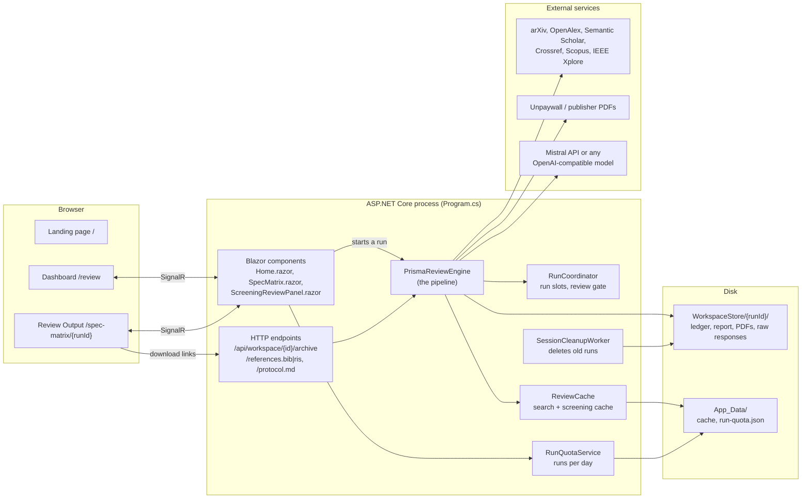
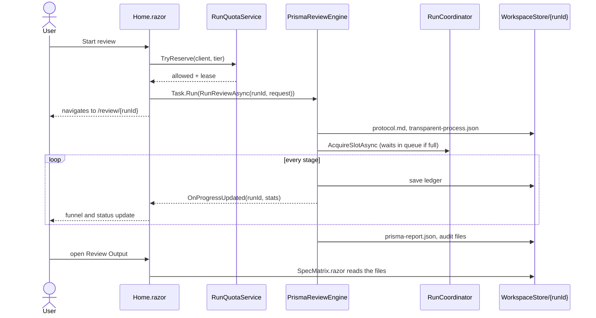

# 1. System overview

TraceableAI is a single ASP.NET Core process that serves a Blazor Server user interface and runs literature reviews in the background. There is no database: every run lives in its own folder on disk, and the pages read what they show from those files. This page describes the parts and how they talk to each other; the next page follows one review from start to finish.

## The parts

The browser talks to the app over a SignalR connection, which is how Blazor Server works: the Razor components run on the server, and only the rendered changes travel to the browser. Downloads are the exception. The run archive can be tens of megabytes with PDFs in it, which is too large for a SignalR message, so the Review Output page links to three plain HTTP endpoints in `Program.cs` instead.

## Who owns what

| Component | File | Lifetime | Responsibility |
|---|---|---|---|
| `PrismaReviewEngine` | `PrismaReviewEngine*.cs` | one instance for the app | Runs reviews, reads and writes run folders, builds the archive |
| `RunCoordinator` | `RunCoordinator.cs` | owned by the engine | Limits how many runs call the model at once, keeps the queue, holds the "waiting for human review" gates |
| `RunQuotaService` | `RunQuotaService.cs` | one instance | Counts runs per visitor and per day, decides the tier (free, own key, developer) |
| `ReviewCache` | `ReviewCache.cs` | one instance | Reuses search responses (24 h) and screening decisions (90 days) |
| `SessionCleanupWorker` | `SessionCleanupWorker.cs` | background service | Deletes run folders older than `Runs:RetentionDays` |
| `UiStateContainer` | `UiStateContainer.cs` | one per browser session | Form values and the current run id while the user moves between pages |
| Sources | `*Source.cs` | one per run and source | Query one bibliographic database and turn its response into `AcademicPaper` records |

The engine is created by hand in `Program.cs`, not by the dependency-injection container, because it needs the API keys and several option objects at construction; it is then registered as a singleton so the pages and endpoints all share it. The endpoints use that same instance through the `reviewEngine` variable rather than a handler parameter (see the comment in `Program.cs` for why).

## How a user's click becomes a run

`Home.razor` starts the run with `Task.Run` and does not wait for it: a review takes minutes, and the page must stay responsive. Progress reaches the page through the engine's `OnProgressUpdated` event, which fires every time the ledger is saved. Because every step is also written to disk, a user who closes the tab can come back to `/review/{runId}` and the page rebuilds itself from the files. If the quota reservation succeeded but the run could not start, the page gives the reservation back with `Quota.Refund(lease)`.

## Where state lives

There are three kinds of state, and knowing which is which explains most of the design.

The **run folder** (`WorkspaceStore/{runId}/`) is the source of truth for a review. The ledger `transparent-process.json` is rewritten after every meaningful step, so the folder always reflects how far the run got. The pages, the download endpoints and a restarted server all read from it. Its contents are described on [page 5](05-ledger-and-archive.md).

The **in-memory state** of a running review is the `RunContext` inside the engine (papers, text chunks, duplicate indexes, dual-screening pairs) and the `RunCoordinator`'s slots and gates. It is lost when the process restarts. On start-up, `MarkInterruptedRuns` finds ledgers that were still running and marks them "Interrupted", so the user sees an honest status instead of a run that seems to hang forever.

The **shared application data** in `App_Data/` is the cache and the quota counters. It survives restarts and deploys (the deploy job never touches it) and is not tied to any single run.

## The model boundary

Every call to the language model goes through `RecordingChatCompletionService` (`LlmCallRecorder.cs`), which wraps the real client and records the stage, model, temperature, a SHA-256 hash of the prompt and the response, token usage and timing. The stage name comes from `LlmStage.Begin("screening")` blocks around each call. That is how `llm-calls.json` can list every call of a run without the pipeline code having to log anything itself.

Which model is used is decided by `LlmFactory.Create` (`LlmProvider.cs`) from the `Llm` configuration section: Mistral through Semantic Kernel by default, or `OpenAICompatibleChatService` for any OpenAI-compatible endpoint, including a local Ollama server. The rest of the code only sees `IChatCompletionService`, which is also what the tests replace with `FakeChatService`.

Structured answers (screening decisions, extraction forms, citation verdicts) go through `LlmJson.GetAsync<T>`, which asks for JSON, validates the answer with a check function and, if the answer is unusable, sends the problem back to the model once before giving up. Before parsing, `LlmJson.ExtractObject` takes the first complete object from the reply and turns real line breaks inside quoted text into `\n`; models often write long prose fields that way, which plain JSON does not allow. Text taken from papers is always wrapped by `PromptSafety.Wrap` before it goes into a prompt, and scanned by `PromptSafety.Scan` for instruction-like phrases; see [page 3](03-search-and-screening.md).
