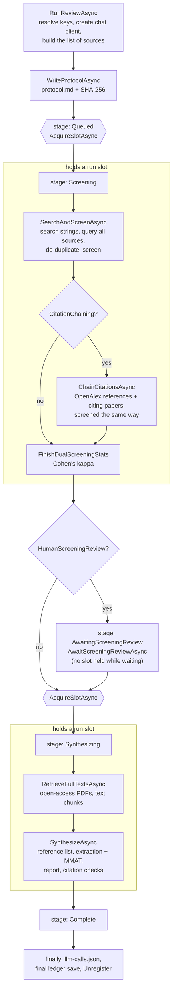

# 2. The review pipeline

One method runs a whole review: `PrismaReviewEngine.RunReviewAsync(runId, request)` in `PrismaReviewEngine.cs`. It is short, and reading it is the fastest way into the codebase, because every other part of the engine is a step it calls. This page walks through it in order. The two following pages go into the steps in detail.

## The shape of a run

A run moves through a fixed set of stages, stored in `ReviewStats.ProcessingStage` so the dashboard can show where it is: `Queued`, `Screening`, `AwaitingScreeningReview` (only with the human check), `Synthesizing`, and then `Complete`, `Failed` or `Interrupted`. The constants are at the top of `PrismaReviewEngine.cs`.

## Step by step

**Setting up.** `ResolveKeys` decides which API keys to use: the visitor's own keys from `request.UserKeys` when given, otherwise the server's. The chat client is created by `LlmFactory.Create` (or the `ChatFactory` test hook) and wrapped in a `RecordingChatCompletionService`, so every model call of this run is recorded. The selected source keys are checked with `GetSourceAvailability`; a source that was ticked but has no usable key is not queried and is recorded in `UnavailableSources`, so the report says it was not searched instead of implying it was. All of this goes into a `RunContext`, the in-memory object that the rest of the run passes around.

**Protocol.** `WriteProtocolAsync` writes `protocol.md` with the question, criteria, sources, limits and screening set-up, and records its SHA-256 in the ledger. This happens before anything is searched, so the protocol's timestamp predates every result (PRISMA 2020 item 24).

**Queue.** `AcquireSlotAsync` asks the `RunCoordinator` for one of the `Runs:MaxConcurrentRuns` slots. While it waits, the run shows its place in line. The slot is held for the model-heavy parts only, which is why the run takes it twice: once for search and screening, once for synthesis, and not while it waits for a human.

**Search and screening** (`PrismaReviewEngine.Search.cs`, `PrismaReviewEngine.Screening.cs`). The model proposes up to three extra search strings, which are appended to the protocol as a dated amendment. Every source is then queried with every string, all sources in parallel. Each record returned is either removed (duplicate, outside the year range, over the per-source cap) or screened; with dual screening, twice. Citation chaining, when switched on, repeats the same admission and screening for the references and citing papers of the included studies. Details on [page 3](03-search-and-screening.md).

**Human review** (optional). With `HumanScreeningReview`, the run saves its ledger with the stage `AwaitingScreeningReview` and then opens a gate in the `RunCoordinator`. The dashboard shows `ScreeningReviewPanel.razor`, the user includes or excludes records, and `SubmitScreeningReview` releases the gate with their decisions. If nobody answers within `Runs:ScreeningReviewTimeoutHours`, the model's decisions are kept and the ledger says so.

**Synthesis** (`PrismaReviewEngine.Report.cs`). `RetrieveFullTextsAsync` fetches legal open-access full text for the included studies and splits it into chunks. `SynthesizeAsync` fixes the reference numbering, extracts and appraises each study, builds the grounded context, and calls `GeneratePrismaChecklistReportWithRAGAsync`, which codes the studies into themes, writes one cited subsection per theme and the discussion, and checks and repairs its citations. Details on [page 4](04-evidence-and-report.md).

**Finishing.** Whatever happens, the `finally` block stores the run settings (model, version, temperatures, prompt fingerprint), saves the ledger one last time, writes `llm-calls.json`, and unregisters the run from the coordinator. For a completed run it also computes `run-metrics.json` (`WriteRunMetricsAsync`, `RunMetrics.Build`) and appends it to the metrics store, which feeds the Metrics page (see [page 6](06-web-app-and-operations.md)). If a step throws, the `catch` block marks the run `Failed` with a sanitised message before re-throwing, so the page never shows a run that silently stopped.

## Every model call, by stage

The `LlmStage` names below are what `llm-calls.json` records for each call, and what the run settings list temperatures for. Screening, extraction and the citation check run at temperature 0; the writing stages run slightly higher.

| Stage name | Method | File | Output |
|---|---|---|---|
| `search-perspectives` | `GenerateSearchPerspectivesAsync` | Search | Up to three extra search strings (protocol amendment) |
| `peer-review-filter` | `IsPeerReviewedAsync` | Screening | Only with the peer-reviewed-only filter |
| `screening` | `ScreenPaperAsync` (first prompt) | Screening | Decision, reasoning, summary, confidence |
| `screening-second` | `ScreenPaperAsync` (second prompt) | Screening | The independent second decision |
| `extraction` | `StudyExtractor.ExtractAsync` | `StudyExtractor.cs` | `extraction.json`: data and MMAT answers with quotes |
| `outline` | `GenerateGroundedOutlineAsync` | Report | `grounded-outline.txt`: themes, claims, reference numbers |
| `report-draft` | inside `GeneratePrismaChecklistReportWithRAGAsync` | Report | Draft PRISMA items as JSON |
| `style` | `StylisticRefinerUtility.RefineAcademicProseAsync` | `StylisticRefinerUtility.cs` | Abstract, rationale and objectives rewritten; `stylistic-transformation-ledger.json` |
| `thematic-coding` | `ThematicSynthesis.CodeStudiesAsync` | `ThematicSynthesis.cs` | Codes per study, anchored to verified findings |
| `thematic-codebook` | `ThematicSynthesis.BuildCodebookAsync` | `ThematicSynthesis.cs` | Themes built from the codes |
| `thematic-coding-second` | `ThematicSynthesis.SecondCodingAsync` | `ThematicSynthesis.cs` | Independent theme assignment, kappa (with `Synthesis:DualCoding`) |
| `theme-sections` | `WriteThemeAsync` | Thematic | One cited subsection per theme |
| `coverage-fill` | `WriteThemeAsync` | Thematic | Revision that adds the theme's uncited studies |
| `discussion` | `WriteDiscussionAsync` | Thematic | Discussion written from the subsections |
| `artifact` | `ArtifactBuilder.BuildAsync` | `ReviewArtifact.cs` | The diagram, table or list the reviewer asked for, built from the finished results |
| `cited-sections` | `GenerateCitedSectionsAsync` | Report | Fallback only: synthesis and discussion in one call |
| `automated-peer-review` | `PeerReviewSectionsAsync` (fallback: `PeerReviewAndReviseAsync`) | Thematic / Report | Critique and revision; `peer-review-feedback.json` |
| `citation-check` | `CitationSupportChecker.CheckAsync` | `CitationSupportChecker.cs` | Verdict and quote per citation, judged on the attributed part of the sentence, with a second check for partly and not supported ones; `citation-audit.json` |
| `citation-repair` | `RepairCitationsAsync` | Thematic | Rewrites or drops rejected citations, which are then checked again |

Not everything in the report comes from the model. The methods sections (eligibility, information sources, search strategy, selection process, data collection and appraisal, protocol) are written in code by `MethodsSectionWriter` from the run's own numbers, so they can never disagree with what actually happened.

## Why the run is built this way

Three design decisions run through the whole pipeline, and they explain code that might otherwise look over-careful.

First, **the ledger is saved after every step.** `PublishAsync` writes `transparent-process.json` and raises `OnProgressUpdated`. That is what lets the page follow a run live, lets a user close the tab and come back, and lets a crashed or restarted run be marked honestly.

Second, **results are applied in a fixed order even when work runs in parallel.** Sources are queried at the same time, and screening runs several records at once (`Llm:ScreeningParallelism`), but the results are always applied in source order and candidate order. Duplicate decisions, reference numbers and the ledger therefore come out the same on every run with the same inputs, regardless of which request happened to answer first.

Third, **nothing the model says is trusted without a check in code.** Structured answers are validated (`LlmJson`), extraction and citation quotes must be found in the source text, reference numbers must exist in the list, the methods text is generated from data, a theme's studies are derived from its codes, and a revision may not drop a citation. Where a check fails, the result is marked (for example "unverifiable") rather than silently dropped.
