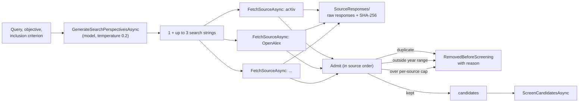
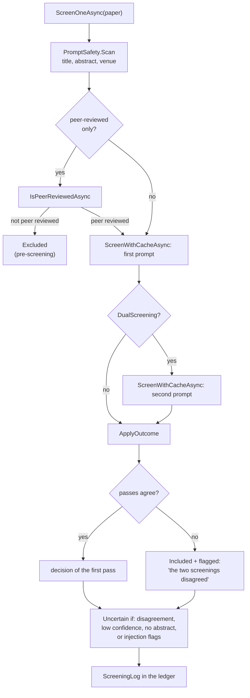

# 3. Search and screening

This page covers the first half of a run: turning a question into a list of screened records. The code is in `PrismaReviewEngine.Search.cs` and `PrismaReviewEngine.Screening.cs`, with one class per bibliographic source.

## From question to candidates

**Search strings.** `GenerateSearchPerspectivesAsync` asks the model for up to three alternative phrasings (a terminology variant, a narrower sub-topic, a methodology framing), in the spirit of STORM's multi-perspective questioning. If the call fails, the run carries on with the original query alone. The strings are appended to `protocol.md` as a dated amendment, and together with the criteria and sources they go into `ProtocolHash`.

The reviewer can also see and edit the strings before the run. "Preview search strings" on the form calls `PreviewSearchStringsAsync`, which makes the same model call with the key the run would use (a page gets five previews). The reviewer can change, remove or add strings, at most four besides the query, and they are sent as `ReviewRequest.SearchStrings`. `ReviewInputGuard` cleans them like every other field (normalised, at most 200 characters each, instruction-like phrases flagged, repeats of the query dropped). A run with `SearchStrings` set does not ask the model at all: it searches the query followed by those strings, sets `ReviewState.SearchStringsReviewed`, and the protocol amendment and the methods text (PRISMA item 7) say that the reviewer approved them. An empty list means the query alone.

**Saturation.** After the search, `SearchSaturation.Compute` goes through the strings in the order they were run and counts, for each, the records no earlier string had found (by identifier, DOI or normalised title, as in duplicate removal). The result is kept as `ReviewState.SearchStringYields`. `SearchSaturation.Hint` turns it into one sentence for the dashboard funnel: when the last string adds at most a tenth of what it retrieved, the search is called close to saturation; otherwise another phrasing or citation chaining may still find studies. A string that was never run because every source had already filled its cap is shown with a dash and named. The methods text gives the same numbers. This is a hint about the phrasings, not about databases that were not searched.

**Querying sources.** `FetchSourceAsync` runs the search strings against one source, one after another, and stops as soon as the source has returned enough distinct records to fill its cap (`MaxResultsPerSource`, split across the strings). All sources run at the same time. Every response is looked up in the `ReviewCache` first (key: source, string and cap; kept 24 hours); a response that is actually used is saved as it was received in `SourceResponses/`, and its SHA-256 goes into the `PlatformSearchLog`. A source that fails is logged as "Faulted" with a sanitised message and the run goes on without it.

**Admitting records.** The results are then processed in a fixed order, source by source and string by string. `Admit` puts every identified record into exactly one bucket: duplicate (same source id, DOI or normalised title as a record seen earlier), outside the year range (records with no year are kept), over the per-source cap, or candidate. Each removal is written to `RemovedBeforeScreening` with its reason, which is what makes the PRISMA flow diagram add up and lets the Review Output page show "Duplicates: show".

## The sources

Every source implements `IAcademicSource` (`IAcademicSource.cs`): a `SourceName`, `FetchPapersAsync(query, maxResults)` returning `List<AcademicPaper>`, and `LastRawResponses`, the raw bodies of the last call.

| Class | Key needed | Notes |
|---|---|---|
| `ArxivSource` | no | Atom XML API. All requests in the app go one at a time through a static gate, 3 s apart, through `OpenSourceHttp`'s retries, because arXiv answers bursts with 503 |
| `OpenAlexSource` | no | Also implements `ICitationGraph`, used for citation chaining; abstracts are rebuilt from OpenAlex's inverted index |
| `SemanticScholarSource` | optional | All requests in the app go one at a time through a static gate, 1 s apart with a key and 3 s without, because the API rate-limits hard |
| `CrossrefSource` | no | Abstracts arrive as JATS XML and are stripped to text |
| `ElsevierSource` | yes | Scopus / ScienceDirect |
| `IeeeXploreSource` | yes | IEEE Xplore API |

The open sources share `OpenSourceHttp` (`OpenSourceHttp.cs`): one `HttpClient` with a `User-Agent` that names the project, and up to five attempts on rate limits and server errors, waiting 3, 6, 12 and 24 seconds (or what the server's `Retry-After` asks for). OpenAlex and Crossref also get the contact e-mail from `OpenSources:ContactEmail`, which puts the app in their faster "polite" pool. `SourceCatalog.cs` holds the list of sources the dashboard offers and which kind of key each needs.

## Screening one record

`ScreenCandidatesAsync` screens several records at a time (`Llm:ScreeningParallelism`), but applies the outcomes to the ledger strictly in candidate order, saving the ledger after each one. That is why the dashboard counts move one record at a time even though the calls overlap.

`ScreenPaperAsync` is the single place where the screening prompt is built; the command-line evaluation tool uses the same method, so it measures exactly what a run does. The paper's title, authors, date, venue and abstract are passed inside `PromptSafety.Wrap` markers, with an instruction that text inside them is data, never instructions. The **second** screener is a different prompt, not a repeat: it works through the exclusion criterion first and then looks for positive evidence for inclusion. Both run at temperature 0 and return JSON that `ScreeningAnswer.Validate` checks (decision exactly "Included" or "Excluded", non-empty reasoning, confidence high, medium or low, and for an exclusion an optional `exclusionReason`).

**Exclusion reasons.** When the model excludes a record it names the main reason as one of four groups in `ExclusionReasons`: off topic, inclusion criteria not met, matches an exclusion criterion, or too little information. The group is stored as `ScreeningLog.ExclusionReason`; the peer-review filter sets "not peer reviewed", and a reviewer who changes a decision to Excluded sets "excluded by the reviewer". An answer without a reason is still valid and counts as "reason not recorded", so older cached answers and runs keep working. `ExclusionReasons.Count` groups the excluded records for the dashboard funnel, the PRISMA flow diagram in `main.tex` lists the groups under "Did not meet criteria", and `ExclusionReasons.Sentence` adds them to the selection text of the report (PRISMA 2020 item 16a). The model's free-text reasoning stays in the ledger for every record. Adding the reason changed the prompt, so `ScreeningPromptVersion` is now `screening-v5`.

**Caching.** `ScreenWithCacheAsync` looks up each decision in the cache under a key built from `ScreeningPromptVersion`, which prompt (first or second), the model, both criteria and the record's metadata. A decision is only reused when all of those are identical, and it is marked `FromCache` in the ledger. Whenever you change a screening prompt, bump `ScreeningPromptVersion` so older decisions are not reused (see [page 7](07-extending-and-testing.md)).

**Applying the outcome.** `ApplyOutcome` turns the one or two answers into a `ScreeningLog`. When the two passes disagree, the record is included and flagged, as in human dual screening: excluding it would hide the disagreement. Confidence is the lower of the two. A record without an abstract is always "low" and its reasoning says so, because the model has only the title to go on. A decision is marked **uncertain** when the passes disagreed, confidence is low, or `PromptSafety.Scan` found instruction-like text such as "ignore previous instructions". Uncertain decisions are the ones shown first in the human review. If the model call itself fails, the record is logged as "Error: not screened" and counted, never silently dropped. When all records are screened, `FinishDualScreeningStats` computes Cohen's kappa between the two passes with `ScreeningConfusion` (`ScreeningEvaluation.cs`).

## Citation chaining

`ChainCitationsAsync` runs one round of backward and forward snowballing. The seeds are the records included from the database search that have a DOI. For each seed, `OpenAlexSource.GetCitationNeighboursAsync` returns up to `OpenSources:ChainingPerPaper` references and citing papers, looked up several seeds at a time (typed local function `LookUp`, throttled like screening). The results go through the same `Admit` and `ScreenCandidatesAsync` as the database search, with origin "citation chaining", so they are de-duplicated against everything seen before and screened the same way. Their raw responses are saved as `SourceResponses/chain-NN-*.json`, and the PRISMA flow reports them as "identified via other methods".

## Human review of the screening

With the "Let me check the screening decisions" option, the run stops after screening. `AwaitScreeningReviewAsync` saves the ledger with the stage `AwaitingScreeningReview` first and only then opens a gate in the `RunCoordinator`, so anyone who sees the gate open also finds the ledger saying the run is waiting. The dashboard shows `ScreeningReviewPanel.razor`, which lists uncertain decisions first. The user's choices come back through `SubmitScreeningReview` as `ScreeningOverride` records, and `ApplyScreeningReview` changes the decisions and PRISMA counters and records `HumanReviewed` and `HumanOverrides`. The run does not hold a slot while it waits, so a review left open overnight does not block other users.
