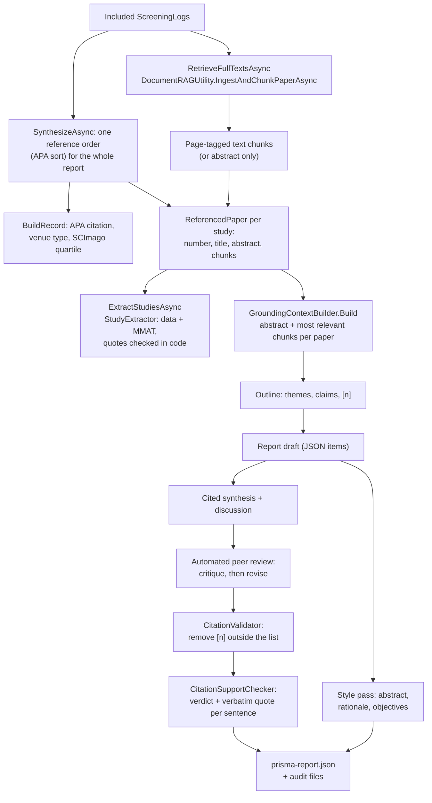

# 4. Evidence and report

This page covers the second half of a run, from the included studies to a checked report. It starts in `RetrieveFullTextsAsync` and `SynthesizeAsync` (`PrismaReviewEngine.Report.cs`) and uses a handful of helper classes, each responsible for one kind of evidence.

## The flow

## Full text

`RetrieveFullTextsAsync` fetches text for every included study, a few at a time, through `DocumentRAGUtility.IngestAndChunkPaperAsync` (or the `FullTextFetcher` test hook). It only uses legal open-access copies, tried in this order: arXiv, the open-access PDF link the source itself reported (OpenAlex, Semantic Scholar, Crossref), and Unpaywall by DOI. A download is streamed with a hard limit of 40 MB and kept only if it really starts with `%PDF`, so an HTML login page or an oversized file never reaches the parser. PdfPig then extracts the text page by page and splits it into 600-character chunks with 100 characters of overlap, each tagged with the paper and page. Where the text came from (or why there is none) is recorded per paper in `FullTextSources` in the ledger; studies without full text are handled from their abstract.

## One reference order

`SynthesizeAsync` sorts the included studies once, by APA reference order, and numbers them 1 to n. Everything downstream uses that numbering: the reference list shown to the model, the `[n]` markers it writes, the extraction table, the citation audit, the bibliography, BibTeX and RIS. An earlier version numbered sources in two different orders and ended up citing the wrong paper, which is why this is done in one place.

`BuildRecord` turns each included `ScreeningLog` into an `IncludedPaperMetricRow` for the tables and charts: APA citation (`ApaCitationBuilder`), venue type, year, and the journal quartile looked up in the SCImago data by `JournalRankingMatcher` (`ScimagoData/`, non-commercial licence).

## Extraction and quality appraisal

`ExtractStudiesAsync` calls `StudyExtractor.ExtractAsync` for every study, a few at a time. The model fills an extraction form (study type, method, sample, up to three key findings, limitations) and chooses an MMAT 2018 category, answering its five criteria with yes, no or can't tell. Every value must come with a verbatim quote, and `StudyExtractor` checks each quote against the text in code, using the same normalised matching as the citation check. An MMAT answer whose quote cannot be found is changed to "can't tell". Studies that are not empirical (position papers, reviews) get the category `not_empirical` and no answers, and the report lists them in a note instead of the table. MMAT is never turned into a single score, following its authors' advice. The result is `extraction.json` and `ReviewState.Extractions`.

## Writing the report

`GeneratePrismaChecklistReportWithRAGAsync` produces the PRISMA items. It is long, but it is a straight sequence:

1. **Grounded context.** `GroundingContextBuilder.Build` gives every included paper its abstract plus an equal share of its most relevant chunks, each labelled with the paper's reference number, so one long PDF cannot crowd out the other papers.
2. **Outline** (`GenerateGroundedOutlineAsync`). Before any prose, the model maps the evidence into themes, each with specific claims and the reference numbers that support them. It is saved as `grounded-outline.txt` and fed into the writing steps.
3. **Draft.** One call returns a JSON object with the title, abstract, rationale, objectives, synthesis and discussion, followed by a Mermaid and a TikZ diagram between `[MERMAID_START]`/`[TIKZ_START]` markers. The Mermaid source is cleaned by `MermaidSanitizer` before it is rendered.
4. **Methods from data.** The eligibility, information sources, search strategy, selection process, data-collection and protocol items are written in code by `MethodsSectionWriter` from the run's own numbers, not by the model.
5. **Style.** `StylisticRefinerUtility` rewrites the abstract, rationale and objectives into plainer academic prose, and every before/after pair goes into `stylistic-transformation-ledger.json`.
6. **Cited sections** (`GenerateCitedSectionsAsync`). The synthesis and discussion are rewritten against the outline so that every specific claim ends with an `[n]` from the reference list.
7. **Automated peer review** (`PeerReviewAndReviseAsync`). One call critiques the two sections for depth, coverage, grounding and over-claiming; a second revises them. Comments and before/after text go into `peer-review-feedback.json`. If the revision fails, the original text is kept and the file says so.
8. **Citation checks,** described below.
9. **Save.** The items are assembled into a `PrismaReport` and written to `prisma-report.json`. If anything in this method throws, a report with the error is written instead and the run's `FailureMessage` explains it.

## The two citation checks

The **range check** (`CitationValidator.ValidateAndStrip`) removes any `[n]` that is not in the reference list, and records each removal. It guarantees that every marker points somewhere real, but not that the paper it points to says what the sentence claims.

The **support check** (`CitationSupportChecker`) closes that gap. `ExtractCitedSentences` splits the synthesis and discussion into sentences and keeps those with markers (ranges like `[2-4]` are expanded). For every cited reference, the sentences citing it are sent to the model with the most relevant excerpts of that paper, and the model must answer per sentence with a verdict (supported, partially supported, not supported) and a verbatim quote. `QuoteOccursIn` then checks the quote in code: both strings are normalised (Unicode NFKC, lower case, letters and digits only), and a quote shortened with "…" must have all its parts in order. A verdict whose quote cannot be found becomes "unverifiable". Nothing is removed from the report; the verdicts and quotes go into `citation-audit.json`, the counts into `ReviewStats`, and the Review Output page shows the verdict when a citation is clicked. The page uses the same sentence split as the checker, so a clicked `[n]` in sentence *i* finds the verdict recorded for sentence *i*.

## Where to look when a report looks wrong

| Symptom | Look in | Likely place in the code |
|---|---|---|
| A claim is not in the cited paper | `citation-audit.json` (verdict and quote) | Cited sections prompt, peer review, `CitationSupportChecker` |
| A theme is missing from the synthesis | `grounded-outline.txt` vs. the synthesis | `GenerateCitedSectionsAsync` |
| An extraction value looks invented | `extraction.json` (`QuoteVerified`) | `StudyExtractor` |
| Methods text disagrees with the funnel | `transparent-process.json` stats | `MethodsSectionWriter` |
| A study has no full text | `FullTextSources` in the ledger | `DocumentRAGUtility` |
| Wrong venue or year in the references | the record in `SourceResponses/` | the source's parser, `ApaCitationBuilder` |
