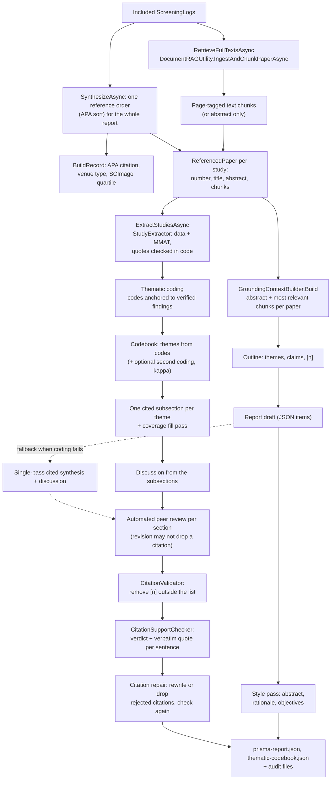

# 4. Evidence and report

This page covers the second half of a run, from the included studies to a checked report. It starts in `RetrieveFullTextsAsync` and `SynthesizeAsync` (`PrismaReviewEngine.Report.cs`) and uses a handful of helper classes, each responsible for one kind of evidence.

## The flow

## Full text

`RetrieveFullTextsAsync` fetches text for every included study, a few at a time, through `DocumentRAGUtility.IngestAndChunkPaperAsync` (or the `FullTextFetcher` test hook). It only uses legal open-access copies, tried in this order: arXiv, the open-access PDF link the source itself reported (OpenAlex, Semantic Scholar, Crossref), Zenodo's own API for Zenodo DOIs (`10.5281/zenodo.*`, open records only), and Unpaywall by DOI. Unpaywall only knows DOIs registered with Crossref, so DataCite DOIs (Zenodo, figshare, arXiv, OSF, Dryad) are not sent to it, and a DOI it does not know is remembered and not asked about again. A download is streamed with a hard limit of 40 MB and kept only if it really starts with `%PDF`, so an HTML login page or an oversized file never reaches the parser. PdfPig then extracts the text page by page and splits it into 600-character chunks with 100 characters of overlap, each tagged with the paper and page. Where the text came from (or why there is none) is recorded per paper in `FullTextSources` in the ledger; studies without full text are handled from their abstract.

## One reference order

`SynthesizeAsync` sorts the included studies once, by APA reference order, and numbers them 1 to n. Everything downstream uses that numbering: the reference list shown to the model, the `[n]` markers it writes, the extraction table, the citation audit, the bibliography, BibTeX and RIS. An earlier version numbered sources in two different orders and ended up citing the wrong paper, which is why this is done in one place.

`BuildRecord` turns each included `ScreeningLog` into an `IncludedPaperMetricRow` for the tables and charts: APA citation (`ApaCitationBuilder`), venue type, year, and the journal quartile looked up in the SCImago data by `JournalRankingMatcher` (`ScimagoData/`, non-commercial licence).

## Extraction and quality appraisal

`ExtractStudiesAsync` calls `StudyExtractor.ExtractAsync` for every study, a few at a time. The model fills an extraction form (study type, method, sample, up to three key findings, limitations) and chooses an MMAT 2018 category, answering its five criteria with yes, no or can't tell. Every value must come with a verbatim quote, and `StudyExtractor` checks each quote against the text in code, using the same normalised matching as the citation check. An MMAT answer whose quote cannot be found is changed to "can't tell". Studies that are not empirical (position papers, reviews) get the category `not_empirical` and no answers, and the report lists them in a note instead of the table. MMAT is never turned into a single score, following its authors' advice. The result is `extraction.json` and `ReviewState.Extractions`.

On the Review Output page, Table 3.3 shows the answers as a risk-of-bias traffic light (`RiskOfBias.For`): a green, amber or red dot next to the words Yes, Can't tell or No, so colour is never the only signal. A "Met" column counts the questions answered yes ("3 of 5"), next to the answers and never instead of them. Below the table, `RiskOfBias.Summarise` draws one small figure per study category: for each of its questions, a bar split into yes, can't tell and no across the studies of that category. The questions differ between MMAT categories, so the figure is per category. `main.tex` gets the same "Met" column.

## Writing the report

`GeneratePrismaChecklistReportWithRAGAsync` produces the PRISMA items. It is long, but it is a straight sequence:

1. **Grounded context.** `GroundingContextBuilder.Build` gives every included paper its abstract plus an equal share of its most relevant chunks, each labelled with the paper's reference number, so one long PDF cannot crowd out the other papers. The total budget is about two chunks per paper (at least 40, at most 120), so a large review does not leave most papers with one chunk or none.
2. **Outline** (`GenerateGroundedOutlineAsync`). Before any prose, the model maps the evidence into themes, each with specific claims and the reference numbers that support them. It is saved as `grounded-outline.txt` and fed into the writing steps.
3. **Draft.** One call returns a JSON object with the title, abstract, rationale, objectives, synthesis and discussion. It no longer writes diagrams: the artifact (below) replaces them. Older runs still have a Mermaid and a TikZ block between `[MERMAID_START]`/`[TIKZ_START]` markers, which the Review Output page and `main.tex` keep showing.
4. **Methods from data.** The eligibility, information sources, search strategy, selection process, data-collection and protocol items are written in code by `MethodsSectionWriter` from the run's own numbers, not by the model.
5. **Style.** `StylisticRefinerUtility` rewrites the abstract, rationale and objectives into plainer academic prose, and every before/after pair goes into `stylistic-transformation-ledger.json`.
6. **Thematic synthesis** (`RunThematicSynthesisAsync`, described in the next section). The results are written as one cited subsection per theme, and the discussion is written from those subsections. When `Synthesis:ThematicSynthesis` is off, or coding fails, the run falls back to **cited sections** (`GenerateCitedSectionsAsync`): one call writes the synthesis and discussion against the outline, with a length that grows with the number of included studies (3 to 8 paragraphs of synthesis, 3 to 5 of discussion). The reason for a fallback is recorded in `thematic-codebook.json` and in the synthesis-methods text.
7. **Automated peer review.** One call critiques the sections for depth, citation coverage, grounding and over-claiming, and each section with medium or high comments is revised (`PeerReviewSectionsAsync`; in the fallback, `PeerReviewAndReviseAsync` revises the two sections). A revision that drops a citation the section had, or cites outside the reference list, is rejected by `ThematicSynthesis.RevisionProblem` and the original is kept. Comments, before/after text and every accepted or rejected revision go into `peer-review-feedback.json`.
8. **Artifact,** described below.
9. **Plain prose.** `ProseCleaner.Clean` turns any Markdown the model wrote back into prose before the citation check: heading lines are removed, list items become sentences of one paragraph (their citations are kept and checked), pipe tables are taken out of the prose, and emphasis, inline code and links lose their markup. Every writing prompt also carries `ProseCleaner.PlainProseRule`. Each change is listed under `FormattingChanges` in `citation-audit.json`, so a removed table is never lost silently.
10. **Citation checks and repair,** described below.
11. **Save.** The items are assembled into a `PrismaReport` and written to `prisma-report.json`. The synthesis overview is `SynthesisResultsItem`, the theme subsections are `SynthesisSections`, the synthesis methods (PRISMA item 13d) are `SynthesisMethodsItem`, written in code by `ThematicSynthesis.MethodsText`, and `CoverageSummary` says how many included studies the text cites and why the others are not cited. If anything in this method throws, a report with the error is written instead and the run's `FailureMessage` explains it.

## Thematic synthesis

A single call that writes the whole synthesis cannot use seventy papers: the outline it worked from allowed at most eighteen claims, and the text was six paragraphs long. The thematic synthesis follows Thomas and Harden (2008), the usual method for synthesising findings in systematic reviews, and spreads the writing over one call per theme so every included study has a place. Each step is in `ThematicSynthesis.cs` (coding, codebook, second coding, guards and text from data) or `PrismaReviewEngine.Thematic.cs` (writing, peer review, repair).

**Coding** (`CodeStudiesAsync`, stage `thematic-coding`, temperature 0). Studies are coded a few at a time (`Synthesis:CodingBatchSize`). The model sees each study's key findings whose quotes `StudyExtractor` found in the paper, numbered `F{ref}.{i}`, and gives one to four short codes, each naming the findings it comes from. A study without verified findings is coded from its abstract, and its code must quote the abstract verbatim; the quote is checked with `QuoteOccursIn`. Each code records its anchor ("verified finding", "verified quote" or "unanchored"), so a reader can see which codes rest on checked evidence. A finding id that belongs to another study gets the answer rejected and asked again. A study with nothing that bears on the objective is recorded with the model's reason.

**Codebook** (`BuildCodebookAsync`, stage `thematic-codebook`). The codes are grouped into descriptive themes, about one per three to six studies and at most `Synthesis:MaxThemes`. Which studies belong to a theme is derived in code from its codes, never taken from the model. The answer is rejected until every coded study is either in a theme or has its codes explicitly left out with a reason (`StudiesWithoutTheme`), so no study disappears silently between coding and writing.

**Second coding** (`SecondCodingAsync`, optional with `Synthesis:DualCoding`). A second, independent prompt sees only the theme names and descriptions and each study's codes, and assigns the studies to themes. Agreement with the first assignment is Cohen's kappa over every study × theme decision (`CompareCodings`, the same maths as dual screening). It is reported, with every disagreement, and does not change the themes.

**Subsections** (`WriteThemeAsync`, stages `theme-sections` and `coverage-fill`). Each theme is written from its own studies only: their codes, verified findings with quotes, and one or two excerpts chosen for the theme. The prompt asks for about one paragraph per four studies (1 to 8) and for every study of the theme to be cited. Code then compares the cited numbers with the theme's studies; if some are missing, one fill pass gives the model their evidence and asks it to integrate them. The fill pass goes through the same revision guard, so it can add citations but never lose one. The themes are written in parallel and assembled in codebook order. `ThemeCoverage` in the codebook records, per theme, which studies were cited after writing, after the fill pass and in the final text.

**Discussion** (`WriteDiscussionAsync`, stage `discussion`). Written from the finished subsections, with facts about the evidence base taken from the extraction (how many studies were read in full text, how many are not empirical, the most common study types) so the limitations paragraph does not have to guess. Its length grows with the number of themes (3 to 6 paragraphs).

The codebook, coverage, second coding and the list of studies not cited (with the reason) are saved as `thematic-codebook.json` and as `ReviewState.ThematicSynthesis`. The Review Output page and `main.tex` show them as an evidence map (themes × studies).

## The artifact

On the dashboard the reviewer chooses what the review should produce besides the text: a concept map of the themes, a flowchart of a process or framework, a comparison table, a bullet-point list, a custom request, or nothing, plus an optional instruction ("a flowchart of how the studies evaluate agent safety, from threat to mitigation"). `ArtifactBuilder.BuildAsync` (stage `artifact`) builds it after the theme subsections and the discussion are final, from those texts only, so it can only contain what the review found. The reviewer's instruction goes into the prompt with `PromptSafety.ReviewerInputNotice`, after the same input check as the other fields.

The model never writes diagram code. It answers with a fixed JSON structure (nodes and edges for diagrams, columns and rows for a table, items for a list), which is validated in code: node ids must exist, every table row must have as many cells as there are columns, sizes are limited, and every `[n]` must be in the reference list; otherwise the answer is sent back once with the problem. `ArtifactBuilder.ToMermaid` draws diagrams for the page, with quoted labels so brackets and citations cannot break the syntax, and `ArtifactBuilder.ToTikz` draws the same diagram for `main.tex`, placing boxes in layers by their longest path from a starting box. Tables and lists become a LaTeX table and an itemized list.

Every node label, table cell and list item is its own field (`artifact-n1`, `artifact-r2c3`, `artifact-b4`) in the range check, the citation support check and the repair pass, exactly like a sentence of the report. After repair the texts are written back with `SetText`, and `Compact` removes boxes or list items whose sentence the repair deleted. The Review Output page shows the diagram with a list of its cited boxes underneath (clickable like any citation), or the table and list with clickable citations in place. If the artifact cannot be built, the report says so in that place instead of showing something invented, and the synthesis-methods text describes what was built and how.

## The citation checks

The **range check** (`CitationValidator.ValidateAndStrip`) removes any `[n]` that is not in the reference list, and records each removal. It guarantees that every marker points somewhere real, but not that the paper it points to says what the sentence claims.

The **support check** (`CitationSupportChecker`) closes that gap. `ExtractCitedSentences` splits the synthesis and discussion into sentences and keeps those with markers (ranges like `[2-4]` are expanded). For every cited reference, the sentences citing it are sent to the model with the paper's abstract, its verified extraction quotes (the passages the synthesis was written from) and its most relevant full-text excerpts, and the model must answer per sentence with a verdict and a verbatim quote.

The check judges the **part of the sentence attributed to the paper**, not the whole sentence. `AttributedClause` takes the text between the previous citation marker (or the start of the sentence) and the marker that cites the paper; the text after the last marker is the review's own interpretation (`UnattributedTail`) and is not held against any paper. A clause too short to stand alone ("Studies [3] show ...") falls back to the whole sentence. The prompt shows the full sentence for context and the attributed part on its own line, and the excerpts are chosen for the attributed parts. This matters because real runs showed that sentences citing three or four papers were judged partly supported far more often than single-citation sentences: the checker held each paper responsible for claims made about the others and for the review's own conclusions. The attributed part is stored with each verdict (`AttributedText`) and shown in the citation popover.

The rubric is written out in the prompt. "Supported" means the excerpts state the attributed claim in substance; different wording or a fair generalisation counts. "Partially supported" means the core is there but a specific element the sentence adds (a number, a qualifier, a scope, a causal link, a comparison) is not. "Not supported" means the excerpts address the topic but say something different. "Not in excerpts" means they do not mention it at all: for a paper read in full text this becomes not supported, but for an abstract-only paper it becomes **insufficient evidence**, because an abstract that does not mention something is no evidence against it. Insufficient evidence is shown in its own colour and counted separately, so it neither passes as support nor counts as an error. `QuoteOccursIn` then checks the quote in code: both strings are normalised (Unicode NFKC, lower case, letters and digits only), and a quote shortened with "…" must have all its parts in order. A verdict whose quote cannot be found becomes "unverifiable".

Citations that the first check judged partly supported or not supported get an independent **second check** (`Synthesis:SecondCitationCheck`). It does not see the first verdict, it is told to read all excerpts, and it gets twice as many excerpts, selected for the attributed part. The final verdict is the better of the two only when that better verdict rests on a verbatim quote found in the paper; otherwise the first verdict stands. Both verdicts are kept (`FirstVerdict`, `SecondVerdict`, `ResolvedBy`), and the report states how many citations were checked twice, how often the two checks agreed, and how many verdicts the second check raised. The rule only lets evidence that is really in the paper change a verdict, so it corrects a first check that missed a passage without turning a weak claim green.

References are checked a few at a time (`Llm:ScreeningParallelism`) and the results are sorted afterwards, so the order does not depend on which call answered first. Every section is its own field (`synthesisResultsItem` for the overview, `synthesis-1`, `synthesis-2`, ... for the themes, `discussionItem`), and the Review Output page uses the same sentence split as the checker, so a clicked `[n]` in sentence *i* of a section finds the verdict recorded for sentence *i* of that section.

The **repair pass** (`CitationRepairer.RepairAsync` in `Verification/`, called through `Grounding.CheckAndRepairAsync`, stage `citation-repair`, `Synthesis:RepairCitations`) acts on the citations judged not supported or partly supported (after the second check), and on positive verdicts whose quote could not be found; not on insufficient evidence, since an abstract that is silent gives nothing to rewrite from. One call per section shows the model each flagged sentence with its attributed part, the cited paper's evidence and the checker's reason, and asks for one of three actions: rewrite only the attributed part so it says what the evidence says (usually by dropping the unsupported number, qualifier or comparison), drop the flagged citation (done in code by `RemoveReference`), or delete the sentence. A rewrite may keep or remove the sentence's own citations but never add one, so a repair cannot move a claim onto a different paper. Changed sentences are checked again; unchanged sentences keep their verdict. Every repair, with the sentence before and after and the original verdicts, is listed under `Repairs` in `citation-audit.json`, next to the summary before (`InitialSupportSummary`) and after (`SupportSummary`) the repair. Nothing is removed silently: the report's citation-check paragraph says how many citations were not supported or partly supported before the repair and how many sentences were changed. Citations that are still partly supported or not supported after the repair stay in the report with their colour, so the reader can see where the model's text goes beyond its sources.

**Checking one citation again.** On the Review Output page, a partly supported or not supported citation has a "Check again" button in its popup. `RecheckCitationAsync` (`PrismaReviewEngine.Recheck.cs`) only works on a finished run. It rebuilds the cited paper from the ledger and fetches its full text: the PDF downloaded during the run is reused, and for an abstract-only paper the open-access sources are tried again, since a copy may have appeared since or the download may have failed during the run. It then runs the same check on that one citation, with eight excerpts and the second check. The new verdict replaces the old one under `SupportChecks`, and the change is kept under `Rechecks` in `citation-audit.json`, with the time, both verdicts, what each was checked against, the quote and the model. `SupportSummary`, the run's counts in the ledger and the citation-check sentence in `prisma-report.json` are updated, and the sentence says how many citations were checked again after the run. The line in the metrics store is not changed, because it measures the run itself. Each re-check costs a few model calls on the server's key, so a run gets `MaxRechecksPerRun` (5), and only one re-check per run runs at a time.

A theme subsection that cites a study not coded under that theme is flagged in the audit (`ThemeNote`) and counted in `ReviewStats.CitationsOutsideTheme`; it is not removed, because a study can legitimately be compared across themes, but a reader can see it.

## Where to look when a report looks wrong

| Symptom | Look in | Likely place in the code |
|---|---|---|
| A claim is not in the cited paper | `citation-audit.json` (verdict and quote) | Cited sections prompt, peer review, `CitationSupportChecker` |
| A theme is missing from the synthesis | `thematic-codebook.json` (themes, `FallbackReason`) | `BuildCodebookAsync`, `RunThematicSynthesisAsync` |
| An included study is never cited | `thematic-codebook.json` (`Uncoded`, `Coverage`, `NotCited`) | Coding prompt, `WriteThemeAsync` fill pass |
| A citation was changed or dropped | `citation-audit.json` (`Repairs`) | `CitationRepairer.RepairAsync` |
| Many orange or red citations | `citation-audit.json` (`AttributedText`, `SecondVerdict`); the Metrics page breakdown by section, evidence and papers per sentence | Writing prompts, `AttributedClause`, the checker rubric |
| An extraction value looks invented | `extraction.json` (`QuoteVerified`) | `StudyExtractor` |
| Methods text disagrees with the funnel | `transparent-process.json` stats | `MethodsSectionWriter` |
| A study has no full text | `FullTextSources` in the ledger | `DocumentRAGUtility` |
| Wrong venue or year in the references | the record in `SourceResponses/` | the source's parser, `ApaCitationBuilder` |
