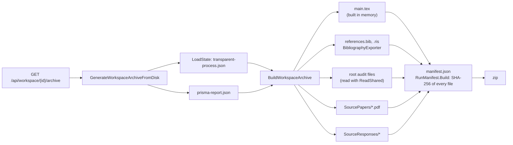

# 5. Ledger, archive and data model

Traceability is the point of the tool, so what it saves matters as much as what it computes. This page describes the files a run leaves behind, the types they are made of, and how the downloadable archive and `main.tex` are built from them.

## The run folder

Every run has a folder `WorkspaceStore/{runId}/`, where the run id is a GUID written as 32 hex digits. The folder path is built in exactly one place, `RunStore.FolderOf`, which also refuses any path that would fall outside the workspace. `RunStore` (in `Runs/`) is shared by every kind of review: it reads the header, checks edit keys, keeps notes and deletes runs.

| File | Written by | When | Contents |
|---|---|---|---|
| `run.json` | `RunHeader.WriteAsync` | first, when the run starts; again when it ends or is marked interrupted | The **header**: run id, module, card, start time, final stage, end time. A folder without it is an older systematic run |
| `protocol.md` | `WriteProtocolAsync`, `ProtocolWriter` | before the search; amendment after the search strings are known | Question, criteria, sources, limits, screening set-up; dated amendments |
| `transparent-process.json` | `SaveStateAsync` (via `PublishAsync`) | after every step | The **ledger**: the whole `ReviewState` |
| `SourceResponses/*.json`, `*.xml` | `SaveRawResponses` | during search and chaining | Each source response exactly as received |
| `*.pdf` | `DocumentRAGUtility` | during synthesis | Open-access full texts used in the run |
| `extraction.json` | `ExtractStudiesAsync` | during synthesis | Data extraction and MMAT answers with quotes |
| `grounded-outline.txt` | report generation | during synthesis | Themes, claims and supporting reference numbers |
| `thematic-codebook.json` | report generation | during synthesis | Codes with their anchors, themes, second coding and kappa, coverage per theme, studies not cited and why |
| `peer-review-feedback.json` | report generation | during synthesis | Reviewer comments; text before and after revision; each section revision and whether the guard kept it |
| `stylistic-transformation-ledger.json` | report generation | during synthesis | Each stylistic rewrite, before and after |
| `reviewer-notes.json` | Review Output page | when the reviewer saves a note | The reviewer's own notes on citations and included studies (`ReviewerNote`), never sent to the model |
| `owner.json` | dashboard | when the run starts | The SHA-256 of the run's edit key; not part of the archive |
| `citation-audit.json` | report generation | during synthesis | Removed markers; verdict and quote per cited sentence and artifact element; repairs with before/after; summary before and after repair; studies not cited; Markdown removed from the prose |
| `prisma-report.json` | report generation | at the end | The PRISMA items shown on Review Output |
| `llm-calls.json` | `finally` block of `RunReviewAsync` | at the end | Every model call; run settings |
| `run-metrics.json` | `WriteRunMetricsAsync` | at the end of a completed run | Quality and cost figures of the run (also appended to the metrics store) |

The ledger is written with `SafeFile.WriteAllTextAsync`: a temporary copy is written and moved into place, so a reader never sees half a file. On Windows that move can briefly fail with "Access to the path is denied" while an antivirus scanner or the search indexer holds the previous version, which stopped runs that save many times a second (screening served from the cache). The move is therefore retried a few times, then the file is overwritten in place, and only if that also fails does the run stop.

`main.tex`, `references.bib`, `references.ris`, `screened.ris` and `manifest.json` are not stored in the folder. They are built when someone downloads the archive, from the files above.

Outside the run folders, `App_Data/metrics/runs.jsonl` (`RunMetricsStore`) keeps one line of `RunMetrics` per completed run. It is not removed by the run clean-up, so quality can be compared across months of runs and app versions. It holds no research question (only a hash of it) and no paper text. `ConfigFingerprint` is a hash of the model, the app version and the settings that shape the output; runs with the same fingerprint were produced the same way. The prompt fingerprint in `llm-calls.json` cannot serve for this, because it hashes the prompts with their paper excerpts and so differs between any two reviews.

## The run folder of a multivocal run

A multivocal or grey literature review (`Modules/Multivocal/`) keeps its own files in the same kind of folder, one file per step, each written with `SafeFile` when its step ends. The step's service names the file in a constant, and `MultivocalModule.ArchiveFiles` lists the ones that go into the archive.

| File | Written by | Contents |
|---|---|---|
| `run.json`, `protocol.md`, `multivocal-plan.json` | `MultivocalPlanner` | The header, the protocol with its SHA-256, and the plan it was written from |
| `multivocal-ledger.json`, `SourceResponses/` | `MultivocalSearcher` | Every search with its raw answers, the sources found with the searches that found them, skipped searches and the stopping rule as applied |
| `multivocal-screening.json` | `MultivocalScreener` | Both screenings of every source, their agreement (κ) and the reviewer's changes |
| `multivocal-pages.json`, `PageText/` | `MultivocalPages` | The record of each page snapshot (address after redirects, access date, SHA-256 of the text, Wayback Machine link, or why it was not fetched); the text itself is in `PageText/` |
| `multivocal-quality.json` | `MultivocalQualityAssessor` | The checklist points of every included source with their quotes, and the threshold |
| `multivocal-map.json`, `multivocal-extraction.json`, `multivocal-synthesis.json` | mapper, extractor, synthesiser | The systematic map, every value with its quote, and the themes with their findings, second placements and the values the support check left out |
| `references.bib`, `references.ris`, `screened.ris` | `GreyReferences` | Written in code after the synthesis; the paper cites by their numbers |
| `mlr-paper.json`, `grounded-outline.txt`, `peer-review-feedback.json`, `citation-audit.json` | `MultivocalWriter` | The written paper, its outline and peer review, and the citation check |
| `multivocal-report.md` | the report page | The report written in code, when opened in the browser that planned the run |
| `llm-calls.json` | `MultivocalRunner` | Every model call, labelled with its step; each start of the run adds its calls after the earlier ones (`MultivocalRunLog`) |
| `run-metrics.json` | `MultivocalWriter.WriteMetricsAsync` | The run's figures, with the setting `Module = multivocal`, also appended to the metrics store, which returns them apart from the systematic runs |

**Page snapshots.** A grey source is cited for what its web page says, so the review keeps the text of each page it reads. `PageFetcher` fetches only pages the run's own searches found; it reads the site's `robots.txt` for the product token `TraceableAI` first (RFC 9309: a missing file allows everything, a server error or an unreadable file allows nothing), waits at least a second between requests to a site or longer for a `Crawl-delay` (a site asking for more than 30 seconds is skipped), refuses sign-in pages, stops at 10 MB and connects only to public addresses. The main text (HTML, plain text or PDF) is kept in `PageText/` for the run's lifetime, so the quality checklist, the extraction and the citation check can be repeated against exactly the text that was read, and it is deleted with the run folder by the clean-up after `Runs:RetentionDays`. The archive holds `multivocal-pages.json` but not `PageText/`: the address, the access date, the SHA-256 of the text, the quoted passages and a link to the Wayback Machine's capture nearest the access date (a link built in code; no capture is requested). Anyone with the archive can therefore check a quote against the page as archived, and anyone with the run can check it against the kept text, without the archive redistributing other people's pages. The privacy page says the same in plain words.

## The data model

```mermaid
classDiagram
    class ReviewRequest {
        Query, Objective
        Inclusion, Exclusion
        MaxResultsPerSource, YearFrom, YearTo
        SelectedSources, UserKeys
        DualScreening, CitationChaining
        HumanScreeningReview, PeerReviewOnly
    }
    class ReviewState {
        ReviewId, Timestamp, SearchQuery
        ProtocolSha256, ProtocolHash
        SearchPerspectives, SelectedSources
        UnavailableSources, FullTextSources
        RunSettings, FailureMessage, CompletedUtc
    }
    class ReviewStats {
        ProcessingStage, QueuePosition
        TotalIdentified, DuplicatesRemoved
        OutsideDateRange, CappedBeyondMaxResults
        Screened, Included, Excluded
        DualScreened, ScreeningDisagreements, ScreeningKappa
        UncertainDecisions, InjectionSuspected
        FullTextRetrieved, CitationsChecked ...
        ThemesIdentified, StudiesCoded
        StudiesCitedInSynthesis, CodingKappa
        CitationsRepaired, CitationsOutsideTheme
    }
    class ThematicCodebook {
        Codes, Themes, Uncoded
        Coverage, SecondCoding, NotCited
        FallbackReason
    }
    class PlatformSearchLog {
        SourceName, QueryUsed, Timestamp
        Status, PapersFound, ErrorMessage
        RawResponseFile, RawResponseSha256, FromCache
    }
    class RemovedRecord {
        PaperId, Title, Source, Reason, DuplicateOf
    }
    class ScreeningLog {
        PaperId, Title, Decision, Reasoning
        SecondDecision, SecondReasoning
        Confidence, Uncertain, InjectionFlags
        Origin, FromCache, HumanReviewed
        ApaCitation, VenueType, Year, Doi, Abstract
    }
    class IncludedPaperMetricRow {
        ReferenceNumber, Title, ApaCitation
        VenueType, Year, Quartile, Category
    }
    class StudyExtraction {
        ReferenceNumber, EvidenceBasis, StudyType
        Method, Sample, KeyFindings, Limitations
        AppraisalCategory, Appraisal
    }
    class PrismaReport {
        TitleItem, AbstractItem, RationaleItem
        EligibilityItem, SourcesItem, SelectionProcessItem
        SynthesisResultsItem, DiscussionItem
        CitationCheckSummary, ProtocolItem ...
    }
    ReviewRequest ..> ReviewState : RunReviewAsync creates
    ReviewState "1" *-- "1" ReviewStats : Stats
    ReviewState "1" *-- "*" PlatformSearchLog : SearchLogs
    ReviewState "1" *-- "*" RemovedRecord : RemovedBeforeScreening
    ReviewState "1" *-- "*" ScreeningLog : Phases.Screening
    ReviewState "1" *-- "*" IncludedPaperMetricRow : SynthesizedRecords
    ReviewState "1" *-- "*" StudyExtraction : Extractions
    ReviewState "1" *-- "0..1" ThematicCodebook : ThematicSynthesis
    ReviewState ..> PrismaReport : written alongside
```

Most of these live in `ReviewModels.cs`; `StudyExtraction` is in `StudyExtractor.cs`, `CitationSupportResult` in `CitationSupportChecker.cs`, and `RunSettingsRecord` with `LlmCallRecord` in `LlmCallRecorder.cs`. `AcademicPaper` is the common shape every source returns (id, title, abstract, date, authors, venue, DOI, URL, PDF link).

A few rules keep the ledger readable years later. Records are **added, never removed**: a duplicate is a `RemovedRecord` with a reason, a failed screening is a `ScreeningLog` with decision "Error". Counts in `ReviewStats` are **derived from the same events** as the lists, which is what lets `PrismaFlowCounts.From(state).IsConsistent` check that the PRISMA flow adds up. And the ledger is **JSON with property names as in the classes**; renaming a property breaks reading older runs, so add new ones instead of renaming.

## The downloadable archive

`BuildWorkspaceArchive` fills the shared paper shape (`Report/ReviewPaper.cs`) with the systematic review's report, method items, figures and tables, has `PaperLatex.Build` write it as `main.tex`, writes the bibliographies and hands them to `RunArchive.Build` (`Report/RunArchive.cs`), the builder every kind of review shares. It adds the run folder's files in the order the module lists them in `ArchiveFiles`, plus any of `RunArchive.CoreFiles` the module did not list, then the source texts and answers. It collects every file as bytes, then writes `manifest.json` with the SHA-256 of each one, the tool and model version, and its own fingerprint, and finally zips everything. `RunManifest.Verify` does the reverse, and the tests use it to prove that an archive has not been changed. `RunManifest.CheckArchive` checks a whole zip, as the `/verify` page does: it lists changed, missing and added files separately and checks the manifest's own fingerprint (`ManifestIsIntact`). Because the upload comes from anyone, it stops at 5,000 files or 400 MB unpacked, counted while unpacking rather than trusted from the zip's directory. Files are read with `RunArchive.ReadShared`, which opens them with `FileShare.ReadWrite`, so a download never fails because a run happens to be writing its ledger at that moment. `ExportReferences` serves the BibTeX and RIS files on their own for the "BibTeX" and "RIS" links.

To check an unpacked archive by hand, recompute a file's fingerprint and compare it with `manifest.json`: `Get-FileHash -Algorithm SHA256 main.tex` on Windows, `sha256sum main.tex` on macOS and Linux. The manifest also records the app version (including the Git commit), the model and the protocol fingerprint.

## How main.tex is built

`main.tex` is assembled line by line in `BuildWorkspaceArchive`. All text coming from the model or from sources passes through `EscapeLatexText`, which escapes LaTeX special characters. The pieces come from different places:

| Part of `main.tex` | Source |
|---|---|
| Title, abstract, rationale, objectives, synthesis overview, one `\subsection` per theme, discussion | `prisma-report.json` (`SynthesisSections` for the themes) |
| Synthesis methods (item 13d), coverage sentence | `prisma-report.json`, written by `ThematicSynthesis.MethodsText` and `CoverageSentence` |
| The artifact: TikZ figure, Table 4.2 or a list | `PrismaReport.Artifact`, `ArtifactLatex`, `ArtifactBuilder.ToTikz` |
| Table 4.1, evidence map of the thematic synthesis | `ReviewState.ThematicSynthesis`, `EvidenceMapTable` |
| Methods sections, protocol and availability statements | `prisma-report.json`, written by `MethodsSectionWriter` |
| "Data & Collection Metrics" paragraph | `MethodsSectionWriter.IncludedSet` |
| PRISMA flow diagram (TikZ) | `PrismaFlowDiagram.ToTikz(PrismaFlowCounts.From(state))` |
| Year bar chart and pie charts | computed from the included records; `LatexPie` |
| Tables 3.1–3.3 (studies, extraction, MMAT) | `SynthesizedRecords`, `ExtractionTables` |
| Synthesis diagram | the TikZ block the model wrote in the draft |
| Bibliography | the included records, in reference-number order |

Tables and bibliography are sorted by `ReferenceNumber`, so they always match the `[n]` markers in the text.
