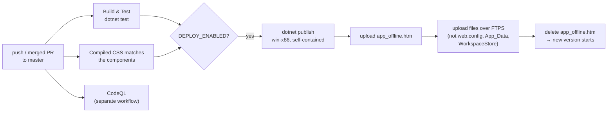

# 6. Web app, operations and deployment

The pipeline on pages 2 to 5 runs inside an ordinary ASP.NET Core web app. This page covers the parts around it: start-up, pages and endpoints, the limits that keep the app affordable and responsive, configuration, security, and how a change reaches the live site.

## Start-up (`Program.cs`)

`Program.cs` reads configuration, creates the shared services, and sets up the request pipeline, in that order.

The configuration sections are bound to option classes: `Quota` → `QuotaOptions`, `Runs` → `RunsOptions`, `Llm` → `LlmOptions`, `Cache` → `CacheOptions`, `OpenSources` → `OpenSourcesOptions`, `Synthesis` → `SynthesisOptions` (thematic synthesis on or off, dual coding, citation repair, second citation check, maximum number of themes, studies per coding call), `Metrics` → `MetricsOptions` (metrics store on or off, its folder), plus `Report:SupportStatement` and the API keys (`MISTRAL_API_KEY`, `ELSEVIER_API_KEY`, `IEEE_API_KEY`). The quota service, cache, run options and review engine are created once and registered as singletons; `UiStateContainer` is scoped, so each browser session gets its own. `SessionCleanupWorker` is registered as a hosted background service. Before the app starts serving, `MarkInterruptedRuns` marks runs that were cut off by the previous shutdown.

The request pipeline then adds, in order: forwarded headers (for a reverse proxy, if one is configured), the security headers on every response, the error page and HSTS outside development, HTTPS redirection, static files, antiforgery, the rate limiter, the three download endpoints, and finally the Razor components in interactive-server mode.

## Pages, components and endpoints

| Route or name | File | Purpose |
|---|---|---|
| `/` | `Components/Pages/Landing.razor` | Public landing page: an animated example of a checked citation, live numbers from the metrics store (or what every run does, when there are none yet), the pipeline, the outputs and the comparison with a general chatbot |
| component | `Components/Layout/SiteHeader.razor` | The top bar every page shares, with the current page marked and a "Skip to content" link |
| `/glossary` | `Components/Pages/GlossaryPage.razor` | Plain-language explanations of the terms the app uses (`Glossary.cs`) |
| `/about` | `Components/Pages/About.razor` | Who made it, what the verdict colours mean, the limits, questions and answers, how to cite, contact |
| `/privacy` | `Components/Pages/Privacy.razor` | What is stored, for how long and what is sent where; the periods come from the running configuration |
| `/model-card` | `Components/Pages/ModelCard.razor` | Which steps the model does and how each is checked in code, the known failure modes, measured citation accuracy from the metrics store |
| `/verify` | `Components/Pages/Verify.razor` | Upload a run archive and check every file against `manifest.json` (`RunManifest.CheckArchive`); nothing is stored |
| `GET /health` | `Program.cs`, `SiteHealth.cs` | Whether the app can do its work, as JSON for uptime monitoring (see "Health, database status and logs" below) |
| `GET /.well-known/security.txt` | `Program.cs`, `SiteSeo.SecurityTxt` | Where to report a vulnerability (RFC 9116), with an expiry date computed when served; see `SECURITY.md` |
| `humans.txt` | `wwwroot/humans.txt` | Who built the site and with what |
| component | `Components/Layout/SiteFooter.razor` | The footer of the public pages, with the about, privacy, model card, verify and project links |
| component | `Components/Layout/Term.razor` | A term with its explanation on hover and focus: `<Term Key="kappa" />` |
| `/start` | `Components/Pages/Start.razor` | Choose the kind of review: one card per method in `ReviewMethods` (systematic review available; multivocal, rapid, living and grey literature reviews coming soon), each naming the reporting standard it follows. "Start a review" on the landing page opens it. A module in preview (`ReviewModules:Preview`, Development only) shows a "Preview" chip and an "Open the preview" button instead |
| `/mlr`, `/mlr/{id}` | `Modules/Multivocal/Pages/MultivocalStart.razor` | The multivocal review's planning form (preview): five steps in the order of the Garousi et al. guidelines (need and audience, Table 4, research questions with their types, search and quality, protocol). "Write the protocol" starts a run that stops at the plan; `/mlr/{id}` shows its protocol and fingerprint, and "Search now" (only in the browser that planned the run) runs the grey searches with the plan's search strings; the "Sources found" tab then lists every search, its hits and new sources, the searches skipped, and the sources found. "Keep page text" on a source fetches its page once (if robots.txt allows it) and keeps the text with the run; the address, date, SHA-256 and a Wayback Machine link are shown and go into the archive, the text does not. "Screen the sources" (step 4 of the form asks for the inclusion and exclusion criteria) screens every source twice with the systematic review's steps; the tab then shows each decision, with why, and can show only the included sources, those to look at, the excluded or the duplicates. "Score the quality" then keeps the page of every included source and scores it on the 20 items of the quality checklist (Table 7); each source shows its points, and its answers with their quotes, and the tab can show the sources that passed, those below the threshold and those not assessed. `?card=grey` plans a grey literature review. "Not found" unless the module is in preview. A run made by another module, opened at its address, is sent to that module's page (`ReviewModules.ElsewhereFor`), and the review and report pages do the same in reverse |
| `/review`, `/review/{runId}` | `Components/Pages/Home.razor` | Dashboard: the review form in three steps with its input check, a summary of the settings once a run starts, and a run panel that follows the run (preview, progress, result, ledger, the human screening review) |
| component | `RunPlanPreview.razor` | Shown in the run panel before a run: the steps the review will take with the current settings, and what it produces |
| component | `RunProgressPanel.razor` | The progress bar, current step with detail, elapsed time and the list of steps |
| `/spec-matrix`, `/spec-matrix/{runId}` | `Components/Pages/SpecMatrix.razor` | Review Output: the report with clickable citations, tables, charts, downloads, notes, "Copy link" and (for the browser that started the run) "Delete run" |
| `GET /api/workspace/{id}/screened.ris` | `Program.cs` | Every screened record, tagged with its decision, for Zotero |
| `/metrics` | `Components/Pages/Metrics.razor` | Run quality metrics across runs: verdict shares per run, groups by app version and settings, and where a run's citations fail. Public, like the code; the links to individual run reports are shown only with the developer token (`Quota:AdminToken`) or in Development, because a run's link opens its report |
| `/review?from={runId}` | `Components/Pages/Home.razor` | A new review with the question, criteria, artifact and options of an earlier run filled in (from "New review from these settings") |
| component | `RunSummaryCard.razor` | What a finished run produced: counts, themes, studies cited, the citation verdicts, and the way into the report; shown at the top of the run panel when a run is complete |
| component | `ScreeningReviewPanel.razor` | The include/exclude list shown while a run waits for review |
| component | `PrismaFunnel.razor` | The funnel on the dashboard, with "show" links for removed records |
| `GET /api/workspace/{id}/archive` | `Program.cs` | The run archive as a zip |
| `GET /api/workspace/{id}/references.bib` / `.ris` | `Program.cs` | The included studies for reference managers |
| `GET /api/workspace/{id}/protocol.md` | `Program.cs` | The protocol, linked from Review Output |

The dashboard subscribes to `ReviewEngine.OnProgressUpdated` while it is open and unsubscribes when it is disposed. Progress is set by the engine through `ReportProgress` (`RunProgress.cs`): the run's step plan (`ProgressPlan`, with citation chaining and the human review only when asked for), the current step, how far it is from 0 to 1 and a short detail such as "16 of 40 records screened" are kept in `ReviewStats`. `RunProgress.Percent` turns them into an overall percentage using a rough weight per step, and within a step the value never goes back. Updates inside a step are sent at most every 400 ms and do not write the ledger, so loops can report freely. The dashboard also re-reads the saved ledger every few seconds, which can be a little behind the live events; `RunProgress.KeepFurthest` keeps whichever is further along for the same run, so the bar never moves back.

On the Review Output page, a bar above the report counts the citations that need attention (partly supported or not supported) and steps through them in reading order with Previous and Next: each step opens the citation's verdict and scrolls it into view (`wwwroot/js/review-output.js`). The Review Output page does not follow a run live; it reads the finished files from the run folder each time it loads. Anyone with a run's link can open it, which is why run ids are random GUIDs and runs are deleted after `Runs:RetentionDays`.

### Read-only links and the edit key

Anyone with a run's link can read it, but only the browser that started the run can change it: delete it, submit its screening review, check a citation again or write notes. When the dashboard starts a run it calls `ClaimRun` (`Runs/RunStore.cs`), which creates a 32-byte random edit key. The browser keeps the key in its local storage (`traceableReview.saveEditKey` in `review-output.js`) and the server keeps only its SHA-256 in `owner.json` in the run folder, which is left out of the archive. Every changing method (`DeleteRun`, `SubmitScreeningReview`, `RecheckCitationAsync`, `SaveNoteAsync`) takes the key and checks it with `CanEdit`, which compares the hashes in constant time. The pages read the key when they open a run and hide the buttons that would change it when the key is missing; the engine refuses either way.

There is deliberately no way to see, copy or restore the key. A key that can be saved can also be forwarded or leaked, and losing it costs little: the run stays readable and expires on its own. Keys older than 30 days are dropped from the browser's storage. Runs started before edit keys existed have no `owner.json` and stay editable by anyone with the link until they expire. A "Copy link" button on the dashboard and the Review Output page copies the run's address for sharing.

### The example run

`Runs:DemoRunId` names a finished run that the landing page links as "See an example report". `SessionCleanupWorker` never deletes it, and `CanEdit` refuses every change to it, even with its key, so the example stays the same for everyone. To set one up, run a review on the server, copy its id from the address bar, and put it in `Runs:DemoRunId` in `web.config` or `appsettings.json`. To retire it, clear the setting; the run then expires like any other.

### Reviewer notes, links and Zotero

On the Review Output page, the reviewer can add a note to any citation (in its popup) and to any included study (in Table 3.1). Notes are kept in `reviewer-notes.json` (`RunStore.SaveNoteAsync`), at most 1,000 characters each, cleaned like the form fields, shown to every reader, and included in the archive. They are never sent to the model.

Table 3.1 links each study's DOI (or its source page when it has no DOI) and, when an open-access copy was downloaded, the PDF; the address is kept as `ReviewState.FullTextUrls`. Only `http` and `https` addresses are linked (`IsWebAddress`), so metadata from a source cannot inject a script link.

`references.ris` tags the included studies with `included`. `GET /api/workspace/{id}/screened.ris` (also in the archive) exports every screened record, tagged `included`, `excluded: <reason>` with the exclusion group, or `not screened`, plus `checked by reviewer` where the reviewer looked at the decision. Imported into Zotero, the whole screening can be filtered by tag.

### Health, database status and logs

`GET /health` (`SiteHealth.Build`) checks what can be checked without spending anything. **storage**: the run folder can be written to (a probe file is written and deleted) and the drive has room; under 500 MB free is "degraded", under 100 MB "unhealthy". **model**: a model key is configured, or a local model is used; the model itself is not called, since that would cost money on every probe. **source:<name>**: one check per scholarly database the app has asked something since it started, from `SourceStatus`. The answer has an overall status (`ok`, `degraded` or `unhealthy`), the app version, the number of active runs and the checks. It is HTTP 503 only when the app is unhealthy, so an uptime monitor (UptimeRobot, Azure, a cron job with curl) can alert on the status code. It contains no keys, paths or visitor data, and it is kept out of search results.

`SourceStatus` records every request that goes through `OpenSourceHttp`: per host, when it last answered, how long it took, and the last problem (rate-limited, server error, timeout, unreachable, or slower than 10 seconds). A request that only got through after waiting for a rate limit counts as rate-limited. `SourceStatus.Summary()` turns the problems of the last 30 minutes into one sentence ("arXiv is slow (answered in 18 s); Semantic Scholar is rate-limiting requests, so it is slower than usual."), which `SourceStatusNote.razor` shows under the sources on the form and in the progress panel while a run is going. It is kept in memory only and covers all runs on the server.

**Logs.** Every log line written while a run works (engine, sources, cache, model calls) carries the run's ID as a logging scope, opened at the start of `RunReviewAsync`. Outside Development the console log is one JSON object per line with a UTC timestamp and the scopes (`AddJsonConsole`), so a log tool can filter by `RunId`; in Development it stays one readable line per entry. A failed run is logged once as an error, with the exception and the step it stopped in. On the dashboard, a failed or interrupted run shows its run ID and the app version, with a "Report this problem" link that opens a new GitHub issue filled in with the run ID, version and step (`SiteSeo.ProblemReportUrl`), and never with the question or criteria, since issues are public. On IIS the console log is written to files only when `stdoutLogEnabled` is on in `web.config`; turn it on while looking for a problem, and off again, since the files are not rotated.

### Search engines and link previews

`SiteSeo.cs` holds what search engines get. `/robots.txt` and `/sitemap.xml` are served from code, so they always use the right address: `Site:PublicUrl` (https://au-btech-literature-review-agent.dk in production), or the request's own address in Development, where `appsettings.Development.json` leaves it empty. The sitemap lists the public pages (`SiteSeo.IndexedPages`). Every page sets its title, description, author, canonical link, Open Graph and Twitter card tags through `Components/Layout/SeoHead.razor`, which also adds a schema.org `BreadcrumbList` for every indexed page except the start page. Pages add their own structured data as JSON-LD: the landing page a `SoftwareApplication`, Metrics a `Dataset`, and About a `ScholarlyArticle` for the OSSYM paper (`SeoHead`'s `StructuredData` and `ExtraJsonLd`). The preview image is `wwwroot/img/social-card.png` (1200×630). A run's own pages (`/review/{runId}`, `/spec-matrix`), the downloads under `/api/` and the error pages are kept out of search results with a `noindex` meta tag and an `X-Robots-Tag` header; robots.txt blocks only `/api/`, because a crawler must be able to fetch a page to see its noindex. `wwwroot/site.webmanifest` names the app and its icons for "add to home screen".

After deploying, add the site in Google Search Console, submit `https://<your address>/sitemap.xml`, and check the preview with the Rich Results Test.

### Accessibility

The app aims at WCAG 2.2 level AA. What that means in the code:

| What | Where |
|---|---|
| A "Skip to content" link as the first thing on every page, and an element with `id="main"` on every page that it jumps to | `SiteHeader.razor`, the `data-skip-to` handler in `wwwroot/js/review-output.js` (a plain `#main` link would go to the home page because of `<base href="/">`) |
| A visible focus ring on everything that can be focused | `:focus-visible` in `Styles/tailwind.input.css` |
| Every form field has a label; its help line is linked with `aria-describedby`; required fields say so; a field the input check rejects gets `aria-invalid` and receives focus | `Home.razor` (`Help`, `Invalid`, `FocusFirstInvalidField`) |
| "Start review" is never silently disabled: the reason is shown next to it, and pressing it (or the reason) goes to the field that needs attention | `StartBlocker`, `BlockerTarget`, `GoToProblem` in `Home.razor` |
| Step changes and the end of a run are announced to screen readers, not every percent | the `role="status"` element and `Announcement()` in `Home.razor` |
| The API key window is a real modal dialog: Escape closes it, Tab stays inside, and focus returns to the button that opened it | `Home.razor`, `trapFocus`/`releaseFocus` in `review-output.js` |
| Opening a citation on Review Output moves focus to its verdict; Escape or Close returns to the citation number, which says its verdict in words | `SpecMatrix.razor` |
| Terms have plain-language explanations on hover and keyboard focus, dismissed with Escape, from one list that also feeds the `/glossary` page | `Glossary.cs`, `Components/Layout/Term.razor` |
| Text contrast at least 4.5:1 (no `text-gray-400` for text), links inside text underlined, click targets at least 24 × 24 px, verdicts never shown by colour alone | the components and `ui-*` classes |
| Animations stop when the system asks for reduced motion | `Styles/tailwind.input.css` |

The CI job **Accessibility** starts the app and runs axe-core on the public pages (`tools/a11y/axe-check.mjs`); a serious or critical problem fails the build. Automated checks find only part of the problems, so keyboard and screen-reader checks by hand are still needed after larger UI changes.

### Speed and the live connection

- **Static files.** `App.razor` links CSS and scripts through `@Assets[...]`, which gives each file a fingerprinted address that changes when the file changes. `MapStaticAssets` serves them Brotli- or gzip-compressed (compressed at build time) with `Cache-Control: max-age=31536000, immutable`, so a returning visitor downloads nothing again until a new version is deployed. Mermaid (3.5 MB) is loaded only when a report has a diagram (`wwwroot/js/mermaid-render.js`). The unused Bootstrap copy was removed from `wwwroot/lib`.
- **The HTML itself is not compressed by the app** on purpose: prerendered pages contain encrypted component state, and compressing secrets together with text a visitor can influence opens the door to BREACH-style attacks. The pages are small (about 30 KB).
- **Lost connection.** `Components/Layout/ReconnectModal.razor` replaces Blazor's grey box with a banner at the bottom that does not cover the page or take keyboard focus, says that a running review keeps going on the server, and offers Try again or Reload when reconnecting fails. Blazor sets the state classes; the styles are in `Styles/tailwind.input.css`.
- **Tab title and notification.** While a run is going, the dashboard's tab title shows its progress ("42% · Your review"), and "✓ Review ready" once it finished while the page was open. "Notify me when it is ready" asks the browser for permission; the notification is only shown when the tab is in the background (`notifyDone` in `review-output.js`).
- **Remembered form.** An unfinished review form is kept in the browser's local storage (`loadDraft`/`saveDraft`, never the API keys) and brought back on the next visit to an empty form, with a "Start empty" button. It is removed when the run starts, and ignored after 30 days. The privacy page says so.
- **Quota messages.** When the free tier or the own-key limit is reached, `RunQuotaService` says when the next run is available ("in 5 h 12 min (midnight UTC)", rounded up) in `QuotaStatus.Message` and `ResetsUtc`, and the dashboard offers to add your own Mistral key.

### Printing a report and the statement on AI use

Review Output has a "Print or save as PDF" button. The print styles (`@media print` in `Styles/tailwind.input.css`, and `print:` classes in `MainLayout.razor` and `SpecMatrix.razor`) release the fixed-height frame so the report flows over A4 pages, hide the top bar, buttons and citation popups, keep figures and table rows from splitting, and add a line at the end with the run id and protocol fingerprint, so a printout can be traced back to its run.

Section 6.4 of every report is a statement on the use of AI, built by `AiUseStatement` only from what the run recorded: the model and app version, the steps the model did, the screening agreement, whether a person checked the screening, and the citation verdicts. Two buttons copy it, or a one-sentence declaration, for a paper or thesis.

### Shared design

The colours, fonts and shadows are design tokens in `tailwind.config.js`: one brand colour (Aarhus University navy, `brand`), greys for everything else, and the three citation verdicts (`verdict-ok`, `verdict-partial`, `verdict-bad`), which are always shown with an icon or a word as well, never by colour alone. The reusable pieces built from them are `ui-*` classes in `Styles/tailwind.input.css`: `ui-container`, `ui-eyebrow`, `ui-h1`/`ui-h2`/`ui-h3`, `ui-lead`, `ui-muted`, the buttons `ui-btn-primary`, `ui-btn-secondary` and `ui-btn-ghost`, `ui-card` and the verdict chips `ui-chip-ok`, `ui-chip-partial` and `ui-chip-bad`. Only buttons have rounded corners (`rounded-btn`, part of every `ui-btn-*`); cards, panels, fields and labels are square, so a rounded shape always means "you can click this". There are also `ui-btn-sm`, `ui-btn-danger`, `ui-label` and `ui-input`. All four pages use `SiteHeader` and these classes. Use them on new pages instead of long class lists, so the pages look like one product. Fonts are the system's own, because the Content-Security-Policy allows no font hosts. The animations on the landing page are CSS only and stop for visitors whose system asks for reduced motion.

### Dashboard layout

The dashboard is laid out so that the next thing to do is always the most visible one. The page scrolls as a whole; on wide screens the run panel on the right stays in view while the left side scrolls.

- **Toolbar.** The page title, the quota as a small chip (tier and runs left) and the API keys button. The account details are kept small because the question matters more.
- **The form, in three steps.** *Question* (query and objective, with a "Try an example" button), *Criteria* (include, exclude, publication years with presets such as "Last 5 years") and *Output* (the artifact, the sources, and an "Advanced options" fold with dual screening, citation chaining, the human screening check, peer-reviewed only and records per source; the fold shows which are on). Every step can be opened directly, and finished steps get a check mark. The fields start empty with examples as placeholders; the help line under a field shows a character count only near the limit.
- **Action bar.** A bar at the bottom of the form stays in reach: one line summarising the choices, the reason the review cannot start yet (for example "Add a search query (step 1)"), and the buttons. "Start now" is offered from the first step once nothing is missing.
- **After the start.** The form folds into a short "Review settings" card with the run's status, its link and a "New review" button, and the run panel switches from the preview (`RunPlanPreview`) to the progress panel and the PRISMA funnel. On a phone the page scrolls to the run panel (`traceableReview.revealOnSmallScreens` in `wwwroot/js/review-output.js`). When the run is complete, `RunSummaryCard` opens the panel. The raw ledger is one tab away ("Ledger (JSON)").

## Limits: quota, slots, cache

Three mechanisms keep the app affordable and responsive, and they are independent of each other.

`RunQuotaService` decides **whether a run may start**. It has three tiers: *Free* (the server's Mistral key; `Quota:FreeRunsPerDay` per client address, `Quota:GlobalFreeRunsPerDay` across everyone, and at most `Quota:FreeTierMaxResults` results per source), *OwnKey* (the visitor's own Mistral key; `Quota:OwnKeyRunsPerHour`), and *Developer* (a valid `Quota:AdminToken`, no limits). In development every run is unlimited when `Quota:UnlimitedInDevelopment` is true. Counters are stored in `App_Data/run-quota.json`. A run reserves its place with `TryReserve` and gets a `QuotaLease`, which is refunded if the run never starts.

`RunCoordinator` decides **when a started run may use the model**. At most `Runs:MaxConcurrentRuns` runs hold a slot at the same time; the rest queue, and their dashboards show the position. It also holds the gates for runs waiting on a human screening review. Everything in it is in memory.

`ReviewCache` decides **whether work can be reused**. Search responses are kept for `Cache:SearchResponseHours` (24) and screening decisions for `Cache:ScreeningDecisionDays` (90), in `App_Data/cache/`. The keys include everything the result depends on, so a changed prompt, model or criterion never reuses an old answer. Reuse is marked per record in the ledger.

Separately, the download endpoints are rate-limited per client address (20 per minute, policy `ArchiveDownloadPolicy`). Runs themselves start over the SignalR connection, which HTTP rate limiting never sees; that is what the quota service is for.

## Clean-up

`SessionCleanupWorker` runs every hour and deletes run folders whose newest file is older than `Runs:RetentionDays`, skipping runs that are still active. It looks at the newest file inside the folder rather than the folder's own date, because the folder date does not change when the ledger inside is rewritten. In the same pass, `ReviewCache.Prune` removes expired cache files.

## Configuration and secrets

| Setting | Where it comes from locally | Where it comes from on Simply.com |
|---|---|---|
| Non-secret defaults | `appsettings.json` | `appsettings.json` (uploaded with the app) |
| API keys, `Quota:AdminToken`, `OpenSources:SemanticScholarApiKey` | `dotnet user-secrets` | Environment variables in the server's `web.config` (`OpenSources__SemanticScholarApiKey`; `__` is the section separator) |

Secrets are never committed. `appsettings.json` holds only placeholders, and the server's `web.config` is excluded from every deploy so the keys on the server are never overwritten.

## Security measures

`SecurityHeaders.Apply` adds a strict Content Security Policy (scripts and styles only from the site itself, images from the site and `data:`), `X-Frame-Options: DENY`, `nosniff`, a referrer policy and a permissions policy to every response. All scripts are served locally: Tailwind is compiled ahead of time into `wwwroot/css/tailwind.css`, and Mermaid is vendored under `wwwroot/lib/mermaid`. User-provided API keys are cleaned with `SecurityUtility.SanitizeApiKey` (only letters, digits and `. _ - :` survive; anything else empties the field) and kept in the browser's protected session storage, not on the server.

The text a reviewer types into the configuration panel goes into prompts, so it is checked by `ReviewInputGuard` before a run starts, both in the dashboard and again at the top of `RunReviewAsync`. The guard normalises every field (Unicode NFKC; invisible and control characters such as zero-width spaces and bidirectional overrides removed; the markers the prompts use for third-party text defused), enforces a length limit per field, and scans for instruction-like phrases with the same patterns `PromptSafety` uses for paper text, minus the two that are ordinary in eligibility criteria ("should be included if ..."). Too-long or missing fields are errors; flagged phrases are shown to the reviewer, who can start the run anyway, and are then listed in `protocol.md` and in `ReviewState.InputFlags`. Nothing the reviewer typed is rewritten silently; the earlier `SanitizeInput` replaced phrases and stripped anything between `<` and `>`, which also removed text such as "< 5 years". Every prompt that contains the reviewer's fields carries `PromptSafety.ReviewerInputNotice`, and every structured answer is still validated in code, which is what bounds what a prompt can make the model do. Log messages go through `SanitizeLogMessage`, which removes line breaks (against log forging) and anything that looks like an API key. Run folder paths are built only by `GetWorkspaceFolderPath`, which checks that they stay inside the workspace.

## Deployment

The site runs on Simply.com's Windows hosting under IIS. That hosting only has .NET Framework installed, so the app is published **self-contained for win-x86** and runs **out of process** (`AspNetCoreHostingModel` in the project file): with in-process hosting, IIS returned empty static files from the host's network share.

`.github/workflows/ci.yml` does the deployment. On every push to master, once *Build & Test* and the CSS check pass and the repository variable `DEPLOY_ENABLED` is `true`, the deploy job publishes the app and uploads it with `lftp` over FTPS, using the secrets `SIMPLY_FTP_USER` and `SIMPLY_FTP_PASSWORD`. It first uploads `deploy/app_offline.htm`, which makes IIS stop the app and show that page for every request, then mirrors the new files (never deleting anything on the server and never touching `web.config`, `App_Data` or `WorkspaceStore`), and finally deletes `app_offline.htm`, which starts the new version. A deploy takes about six minutes, most of it the upload. If it fails halfway, the site keeps showing the update page rather than running a half-updated app; re-run the job or delete the file by FTP.

The CSS check exists because Tailwind only includes classes that literally appear in the components, including words in ordinary text. If you change a component, run `npm run build:css` in `AuBtechReviewAgent` and commit `wwwroot/css/tailwind.css` with it. `codeql.yml` scans C# and JavaScript on every push; `release.yml` runs when you push a version tag such as `v1.2.0` and creates a GitHub release, which Zenodo archives when that integration is switched on; Dependabot proposes dependency updates, which pass through the same checks.
