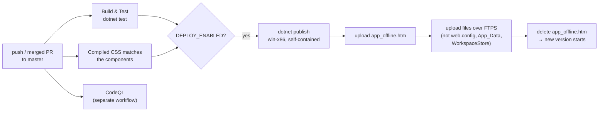

# 6. Web app, operations and deployment

The pipeline on pages 2 to 5 runs inside an ordinary ASP.NET Core web app. This page covers the parts around it: start-up, pages and endpoints, the limits that keep the app affordable and responsive, configuration, security, and how a change reaches the live site.

## Start-up (`Program.cs`)

`Program.cs` reads configuration, creates the shared services, and sets up the request pipeline, in that order.

The configuration sections are bound to option classes: `Quota` → `QuotaOptions`, `Runs` → `RunsOptions`, `Llm` → `LlmOptions`, `Cache` → `CacheOptions`, `OpenSources` → `OpenSourcesOptions`, `Synthesis` → `SynthesisOptions` (thematic synthesis on or off, dual coding, citation repair, maximum number of themes, studies per coding call), plus `Report:SupportStatement` and the API keys (`MISTRAL_API_KEY`, `ELSEVIER_API_KEY`, `IEEE_API_KEY`). The quota service, cache, run options and review engine are created once and registered as singletons; `UiStateContainer` is scoped, so each browser session gets its own. `SessionCleanupWorker` is registered as a hosted background service. Before the app starts serving, `MarkInterruptedRuns` marks runs that were cut off by the previous shutdown.

The request pipeline then adds, in order: forwarded headers (for a reverse proxy, if one is configured), the security headers on every response, the error page and HSTS outside development, HTTPS redirection, static files, antiforgery, the rate limiter, the three download endpoints, and finally the Razor components in interactive-server mode.

## Pages, components and endpoints

| Route or name | File | Purpose |
|---|---|---|
| `/` | `Components/Pages/Landing.razor` | Public landing page |
| `/review`, `/review/{runId}` | `Components/Pages/Home.razor` | Dashboard: API keys and quota, the review form, run status, PRISMA funnel, JSON view, the human screening review |
| `/spec-matrix`, `/spec-matrix/{runId}` | `Components/Pages/SpecMatrix.razor` | Review Output: the report with clickable citations, tables, charts, downloads, "Delete run" |
| component | `ScreeningReviewPanel.razor` | The include/exclude list shown while a run waits for review |
| component | `PrismaFunnel.razor` | The funnel on the dashboard, with "show" links for removed records |
| `GET /api/workspace/{id}/archive` | `Program.cs` | The run archive as a zip |
| `GET /api/workspace/{id}/references.bib` / `.ris` | `Program.cs` | The included studies for reference managers |
| `GET /api/workspace/{id}/protocol.md` | `Program.cs` | The protocol, linked from Review Output |

The dashboard subscribes to `ReviewEngine.OnProgressUpdated` while it is open and unsubscribes when it is disposed. The Review Output page does not follow a run live; it reads the finished files from the run folder each time it loads. Anyone with a run's link can open it, which is why run ids are random GUIDs and runs are deleted after `Runs:RetentionDays`.

## Limits: quota, slots, cache

Three mechanisms keep the app affordable and responsive, and they are independent of each other.

`RunQuotaService` decides **whether a run may start**. It has three tiers: *Free* (the server's Mistral key; `Quota:FreeRunsPerDay` per client address, `Quota:GlobalFreeRunsPerDay` across everyone, and at most `Quota:FreeTierMaxResults` results per source), *OwnKey* (the visitor's own Mistral key; `Quota:OwnKeyRunsPerHour`), and *Developer* (a valid `Quota:AdminToken`, no limits). In development every run is unlimited when `Quota:UnlimitedInDevelopment` is true. Counters are stored in `App_Data/run-quota.json`. A run reserves its place with `TryReserve` and gets a `QuotaLease`, which is refunded if the run never starts.

`RunCoordinator` decides **when a started run may use the model**. At most `Runs:MaxConcurrentRuns` runs hold a slot at the same time; the rest queue, and their dashboards show the position. It also holds the gates for runs waiting on a human screening review. Everything in it is in memory.

`ReviewCache` decides **whether work can be reused**. Search responses are kept for `Cache:SearchResponseHours` (24) and screening decisions for `Cache:ScreeningDecisionDays` (90), in `App_Data/cache/`. The keys include everything the result depends on, so a changed prompt, model or criterion never reuses an old answer. Reuse is marked per record in the ledger.

Separately, the download endpoints are rate-limited per client address (20 per minute, policy `ArchiveDownloadPolicy`). Runs themselves start over the SignalR connection, which HTTP rate limiting never sees; that is what the quota service is for.

## Clean-up

`SessionCleanupWorker` runs every hour and deletes run folders whose newest file is older than `Runs:RetentionDays`, skipping runs that are still active. It looks at the newest file inside the folder rather than the folder's own date, because the folder date does not change when the ledger inside is rewritten. In the same pass, `ReviewCache.Prune` removes expired cache files.

## Configuration and secrets

| Setting | Where it comes from locally | Where it comes from on Simply.com |
|---|---|---|
| Non-secret defaults | `appsettings.json` | `appsettings.json` (uploaded with the app) |
| API keys, `Quota:AdminToken`, `OpenSources:SemanticScholarApiKey` | `dotnet user-secrets` | Environment variables in the server's `web.config` (`OpenSources__SemanticScholarApiKey`; `__` is the section separator) |

Secrets are never committed. `appsettings.json` holds only placeholders, and the server's `web.config` is excluded from every deploy so the keys on the server are never overwritten.

## Security measures

`SecurityHeaders.Apply` adds a strict Content Security Policy (scripts and styles only from the site itself, images from the site and `data:`), `X-Frame-Options: DENY`, `nosniff`, a referrer policy and a permissions policy to every response. All scripts are served locally: Tailwind is compiled ahead of time into `wwwroot/css/tailwind.css`, and Mermaid is vendored under `wwwroot/lib/mermaid`. User-provided API keys are cleaned with `SecurityUtility.SanitizeInput` and kept in the browser's protected session storage, not on the server. Log messages go through `SanitizeLogMessage`, which removes line breaks (against log forging) and anything that looks like an API key. Run folder paths are built only by `GetWorkspaceFolderPath`, which checks that they stay inside the workspace.

## Deployment

The site runs on Simply.com's Windows hosting under IIS. That hosting only has .NET Framework installed, so the app is published **self-contained for win-x86** and runs **out of process** (`AspNetCoreHostingModel` in the project file): with in-process hosting, IIS returned empty static files from the host's network share.

`.github/workflows/ci.yml` does the deployment. On every push to master, once *Build & Test* and the CSS check pass and the repository variable `DEPLOY_ENABLED` is `true`, the deploy job publishes the app and uploads it with `lftp` over FTPS, using the secrets `SIMPLY_FTP_USER` and `SIMPLY_FTP_PASSWORD`. It first uploads `deploy/app_offline.htm`, which makes IIS stop the app and show that page for every request, then mirrors the new files (never deleting anything on the server and never touching `web.config`, `App_Data` or `WorkspaceStore`), and finally deletes `app_offline.htm`, which starts the new version. A deploy takes about six minutes, most of it the upload. If it fails halfway, the site keeps showing the update page rather than running a half-updated app; re-run the job or delete the file by FTP.

The CSS check exists because Tailwind only includes classes that literally appear in the components, including words in ordinary text. If you change a component, run `npm run build:css` in `AuBtechReviewAgent` and commit `wwwroot/css/tailwind.css` with it. `codeql.yml` scans C# and JavaScript on every push; `release.yml` runs when you push a version tag such as `v1.2.0` and creates a GitHub release, which Zenodo archives when that integration is switched on; Dependabot proposes dependency updates, which pass through the same checks.
